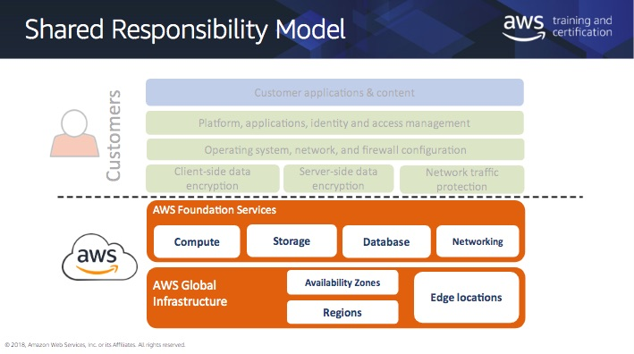
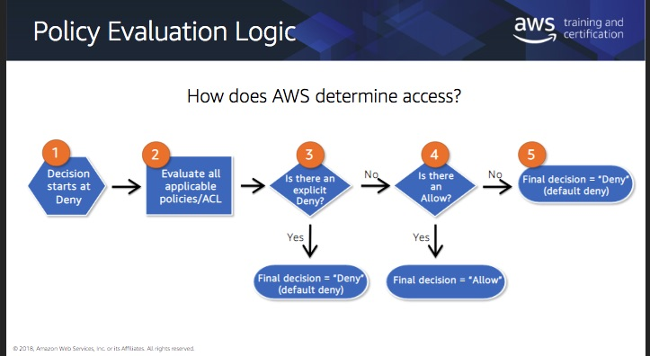

# Managing Access to S3

Share responsibility model



Access Determination



IAM Policies

* Assigned to IAM user, groups, and role
* Grant access to AWS resources

Bucket Policies

* Resource based policy assigned to an S3 buckets
* Incorporate user retrictions without using IAM - includes action, principal, and resource


IAM and Bucket Policies

* IAM - what can this user do in AWS. USe when controlling access to AWS services, policies in the IAM environment, use fewer more detailed policies
* Bucket policies - Who can access this bucket? 
    * Policies in the s3 environment.
    * Cross account access to your Amazon s3 resources
    * Size limits on IAM policies

Policy Language Elements

* Resource - elements the statement covers
* Action - resource operations to allow of deny
* Effect - Allow or Deny
* Principal - IAM user, federated user, assumed role user, AWS account, AWS service, or other principal entity
* Condition - expressions for when a policy is in effect. Match against information in the request for access to the resource

Some resources

* [Access policy langauge overview](https://docs.aws.amazon.com/AmazonS3/latest/dev/access-policy-language-overview.html)
* [Bucket policy examples](https://docs.aws.amazon.com/AmazonS3/latest/dev/example-bucket-policies.html)
* [IAM policy examples](https://docs.aws.amazon.com/IAM/latest/UserGuide/access_policies_examples.html)

Policy Elements

* NotPricipal
    * Denies all except the principle defined; do not use with policy statement "Effect":"Allow"
    * When using Deny the order in which AWS evaluates principals makes a difference
    * Does not explicitly grant access when used alone in a policy
    * Need to include the ARN for the AWS account in addition to the ARN of the user, a user cannot have more permissions than its parent account.
* NotAction
    * Matches everything except the list defined
    * Used with statement Effect Allow or Deny
        * Allow: provide access to all except listed
        * Deny: deny access to all except listed - does not explicitly grant access to other actions not listed


Example - deny access to all servcices except s3 unless the user is signed in using MFA

```
Statement: [{
    "Effect":"Deny",
    "NotAction":"s3:*",
    "Resource":"*",
    "Condition":{"BoolIfExists":{
        "aws:MultiFactorAuthPresent":"false"
    }}
}]
```

* NotResource
    * Matches everything except the list of defined resources
    * Use with statement effect - allow or deny
        * Allow: provide access to all except listed
        * Deny: deny access to all except listed

Example - you have a group named hrpayroll. Members of hr payroll should not be allowed to access any s3 resources except the payroll folder in the hr bucket

```
"Statement": {
    "Effect":"Deny",
    "Action":"s3:*",
    "NotResource":[
        "arn:aws:s3:::hrbucket/payroll",
        "arn:aws:s3:::hrbucket/payroll/*"
    ]
}
```

The above provides the restriction, additional policy elements are needed to provide the grant.


Cross-Account Access

* It is possible with cross-account access to have a mismatch between bucket owner* and object over.
* Scenario
    * Bucket policy statement 1: allow cross account permission to Jane in account B and to IAM user John (account A) to get, list, and put objects in the images bucket
    * Jane puts and object, object over is account B, bucket owner is John, John denied access to objects created by Jane.
    * Can add a condition to the bucket policy to require bucket-owner-full-control when account B uploads objects

More managing access scenarios [here](https://docs.aws.amazon.com/AmazonS3/latest/dev/s3-access-control.html)

Multiple Policy Evaluation

* Can put all the permissions in a single policy or in multiple policies.
* If a policy has multiple statements, a logical or is applied across those statements when evaluated
* Users typically have multiple policies that apply to them, but aren't necessarily attached to them.
* User might have policies associated with it, belong to a group that has policies assocaited with it, accessing a bucket that has a policy associated with it.
* All applicable policies are evaluated, and a deny or allow is determined.

Access Control Lists

* Use bucket policies or iam policies for access control. ACLs are a legacy mechanism.
* ACL - subresource attached to bucket and objects
    * You can only grant permission to other AWS accounts or Amazon s3 predetermined groups
        * Authenticated users group - represents all aws accounts. Allows any aws authenticated user in the world to access the resouce
        * All users group - allows anyone in the world to access
        * Log delivery group - write permission on a bucket enables this group to write server access logs

Block Public Access

* By default all amazon s3 resources are private
* Can explicitly [configure public access control default and behavior](https://docs.aws.amazon.com/AmazonS3/latest/dev/access-control-block-public-access.html)
    * Allows admins and bucket owners to set up centralized controls to limit public access
* Available via s3 management console, aws cli, and aws sdks

Avoiding Accidental Deletes

* Use bucket policies to restrict deletes
* Enable MFA delete on versioning enabled buckets
    * Enable via cli or sdk, not avaliable in the console