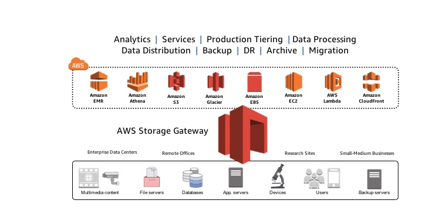

# Storage Gateway Overview

Seamlessly connect on premise applications with AWS storage, leveraging cloud storage scalability, reliability, durability, and economics

## Hybrid Cloud Deployment

Integrate on premise and cloud resources

Typically deployed as a virtual machine in your on-premise storage environment, connecting existing apps, devices, and systems to the gateway.

The gateway connects to AWS to store data in S3 and Glacier, and provides a local low-latency cache. It is also integrated with IAM, cloud trail, cloudwatch, and KMS.

## Spectrum of Use Cases

## Storage Gateways: File, Volume, and Tape

* File Gateways: NFS (v3 and v4.1) interface
    * On-premises file storage backed by Amazon S3 objects
* Volume Gateway: iSCSI block interface
    * On-premises storage backed by S3 with EBS snapshots
* Tape gateway: iSCSI virtual tape library (VTL) interface
    * Virtual tape storage in Amazon S3 and Glacier with VTL management

Common Capabilities

* Standard storage protocols (NFS, iSCSI)
* Local caching
* Efficient data transfer with buffering and bandwidth management
* Native data storage in AWS (Amazon S3, EBS snapshots, Glacier)
* Stateless virtual appliance for resliency
* Integration with AWS monitoring, management, and security

## File Gateway

* Data stored and retrieved from S3 bucket
* One to one mapping from files to objects
* File metadata stored in object metadata
* Buckets accessed through IAM role you own and manage
* Use S3 lifecycle policies to manage data

## Volume Gateway

* Block storage in S3 accessed through the volume gateway
* Data compressed in-transit and at rest
* Backup on premises volumes to EBS snapshots
* Create on-premises volumes from EBS snapshots
* Up to 1 PB of total volume storage per gateway

### Volume Gateway: Stored Volumes

* Volume you already have, put it behind a gateway to ensure it is durably backed up to AWS
    * Large dataset without a good, cacheable smaller working set, lots of random reads and writes, and you need access to all the data with low latency at all times.
* Primary data is stored on permise
* Asynchronous upload to AWS
* Point in time backups stored as Amazon EBS snapshots
* Up to 32 volumes, up to 32 TB each, for up to 1 PB per gateway

### Volume Gateway: Cached

* Cached volumes use S3 as your primary data storage
* Frequently accessed data is cached on-premises
* Point in time backups stored as EBS snapshots
* Up to 32 volumes, up to 32 TB each, for up to 1 PB per gateway

## Tape Gateways

* Virtual tape storage in S3 and Glacier accessed via gateway
    * VTL via VM with 1500 tapes in the library, and unlimited tapes in S3
* Data compressed in transit and at rest
* Up to 1 PB total tape storage per gateway, unlimited archive capacity
* Supports leading backup applications, basically virtual tape you can use with existing tape infrastructure
* Cache of most recently written backups - low latency local restores

## Deploying Storage Gateway On-Premises

* Deploy on perise (VMWare ESXi or Microsoft Hyper V)
    * VMWare - will need a VMWare VSphere client to connect to the host
    * Hyper-V - will need a Hyper-V manager on a microsoft client computer to connect to the host
* Can run on EC2 as well
    * GAteway VM as an AMI
    * Can only run file, cached volume, and tape gateways
    * Typical use cases are disaster recovery and data mirroring

