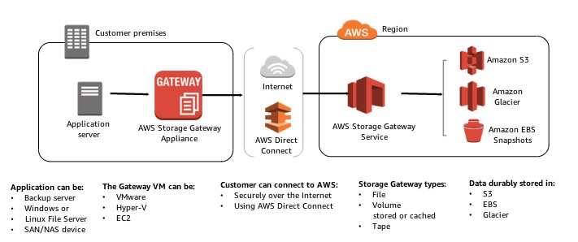
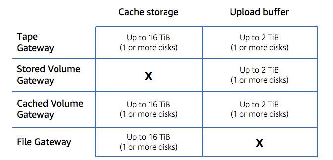

# AWS Storage Gateway Types Deep Dive

## Storage Gateway Architecture

### Data Writes

1. Application writes data using iSCSI or NFS
2. Gateway appliance stores blocks locally, compresses it asynchronously and uploads the changed data securely
3. Storage gateway service stored the compressed data in s3, glacier, or EBS with AES-256 encryption

### Data Reads

1. Reads from the gateway appliance vis iSCSI or NFS protocol
2. Gateway returns the requested data from local storage (if stored locally)
3. If not in the local store, the data is requested from the gateway service. The gateway service retrieves the compressed data from s3, glacier, or EBS
4. The gateway appliance receives data from the storage gateway service, decompresses it, stores it locally, and responds to the application

On premises storage needs to provide local disk for cache and upload buffer. Size recommendations [here](https://docs.aws.amazon.com/storagegateway/latest/userguide/resource-gateway-limits.html)

Cached Data States

* Dirty - written but not yet uploaded. Cannot be evicted.
* Hot data - recently read or written
* Cold data - less recently used data

Upload Buffer

* Staging area for the gateway before it uploads the data to AWS

## Storage Gateways: File

