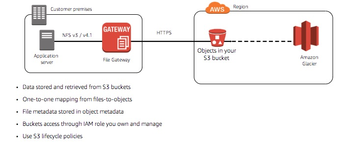
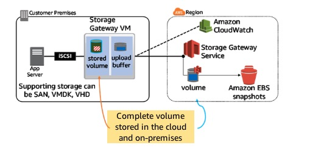
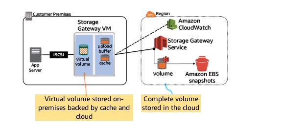
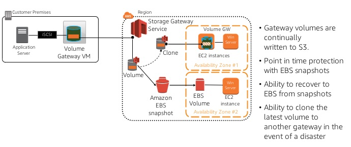
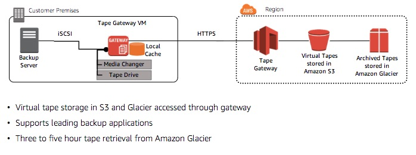
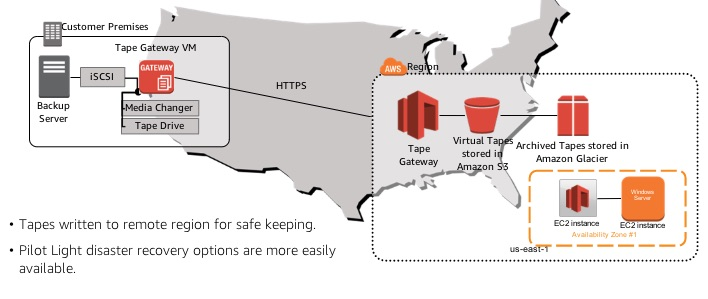

# AWS Storage Gateway Types Deep Dive

## Storage Gateway Architecture

### Data Writes

1. Application writes data using iSCSI or NFS
2. Gateway appliance stores blocks locally, compresses it asynchronously and uploads the changed data securely
3. Storage gateway service stored the compressed data in s3, glacier, or EBS with AES-256 encryption

### Data Reads

1. Reads from the gateway appliance vis iSCSI or NFS protocol
2. Gateway returns the requested data from local storage (if stored locally)
3. If not in the local store, the data is requested from the gateway service. The gateway service retrieves the compressed data from s3, glacier, or EBS
4. The gateway appliance receives data from the storage gateway service, decompresses it, stores it locally, and responds to the application

On premises storage needs to provide local disk for cache and upload buffer. Size recommendations [here](https://docs.aws.amazon.com/storagegateway/latest/userguide/resource-gateway-limits.html)

Cached Data States

* Dirty - written but not yet uploaded. Cannot be evicted.
* Hot data - recently read or written
* Cold data - less recently used data

Upload Buffer

* Staging area for the gateway before it uploads the data to AWS

## Storage Gateways: File

* One to one mapping from files to objects.
    * Enables native access to S3 capabilities on the objects
* Controls on how your data is accessed
    * NFS/files options export - allowed clients, read-only/read-write exports, user squasing, default object ownship (uid/gid), default object permissions
    * S3 options per buckets - IAM role for access, storage class, object encryption with KMS, guess mime type
* Metadata and worload automation
    * Cached metadata and object inventory maintained on the applicance
    * RefreshCache API
    * CloudWatch upload events from gateway
* Reads
    * Reads byte ranges, has hueristics to do read ahead, etc. 
* Writes
    * Optimizes uploads via multipart uploads and similar techniques, dedup of writes, etc
    * Write opt example - appending data to a file: just appended data is uploaded to gateway service, gateway service uses the data in the cloud and the newly uploaded append data to create a new object
* Refresh Cache API Use Cases
    * Sync in cloud workloads to on premise view of files
    * S3 cross region replication - allow active active, surface replicated data to on prem
    * AWS snowball use

## Storage Gateways: Volume

On-premises block storage backed by S3 with EBS snapshots

* Create on-premises volumes from EBS snapshots
* Up to 1 PB of total volume storage per gateway
* iSCSI mount target
* Block device is opaque to most users
* Data compression over the wire, data stored in an s3 service bucket (rather than the customer's bucket)
* Customer has access to the data as an EBS snapshot

2 modes - stored and cached (see previous notes)

### Stored Volume

* Sensitive to latency, need all the data - stored volume (which is stored locally)
* LUN - logical unit number, device addressed by the SCSI protocol
    * Assume you have a LUN that has data on it, a file system, and is formatted. 
    * You can present it to the storage gateway, and use the storage gateway to present that back directly to the application server. This means you can take existing data inside your data center and transfer it into AWS with no change to your application other than connecting to the gateway. No volume reformatting, no copying, etc.

### Cached Volume Mode

* Write
    * Writes to virtual volume, data stored in the cache.
    * Gateway compresses and encrypts the data as it gets moved into the upload buffer
    * Cache is write-back: app gets the ack quickly as store to cache is acked, sync to cloud occurs later
* Reads 
    * In the cache, served back immediately
    * Not in the cache, gateway must download from the gateway service, cache it, then serve it (i.e. read-through cache)

* Volume recovery point - a point in time at which all the data in a volume is consistent
    * Create a snapshot
    * Clone the volume

    

 ## Snapshots

 Volume gateway
 
 * When a snapshot is initiated, a snapshot marker is written to the virtual volume
 * The snapshot marker is used to reconcile the data already available in the cloud, the data in flight to the cloud, and the remaining data in the cache. When all of the data at the point of the snapshot has made it to the cloud the fully assembled EBS snapshot can be completed.

 ## Tape Gateway

 

* Drop in replacement for physical tape libraries.
* Use a tape backup product to work with the tape gateway
* Remote region backup
    * Keep backup many miles away (bicoastal backup)

