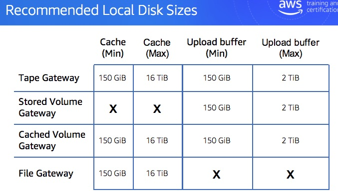

# Creating Storage Gateways

## Creating File Gateways

* Pick the host platform, download the image, follow the instructions for set up.
* Need the gateway VM IP to connect to the service for activation
    * Configuring local disks - pick disk for local cache. File gateway does not use an upload buffer. You must allocate at least one local disk for the cache.

## Creating a Volume Gateway

* Choose the type of volume gateway (cached or stored)
* When deploying the gateway you identified the disks to use with the gateway. You then configure the local disks, selecting which to use for cache, which to use for upload buffer.

## Creating a Tape Gateway

* Activating - will need to select the backup application to use

## Local Disk Size Recommendations

