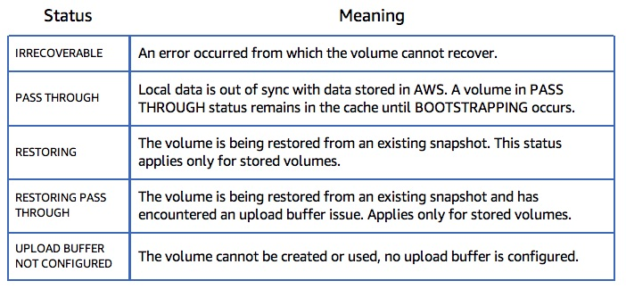
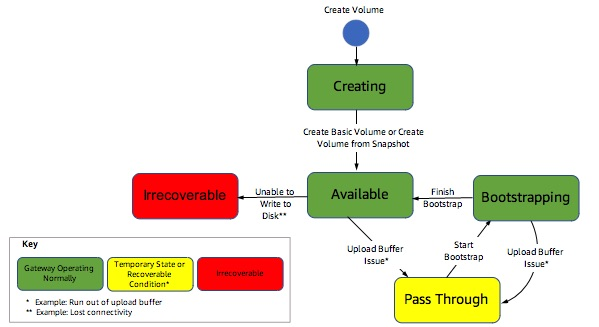
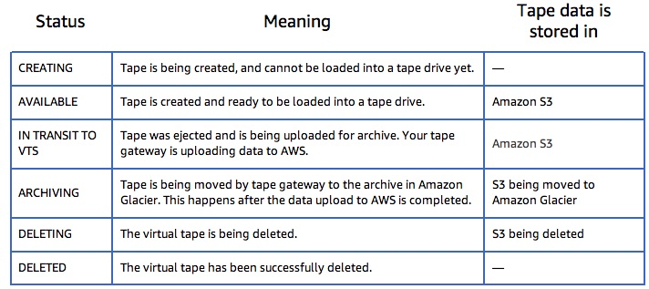
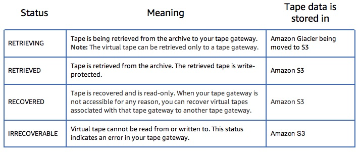

# Managing Storage Gateways

## Managing a File Gateway

* Adding file shares
    * Specify bucket name, storage class, select options (guess mime type, give bucket owner full control, enable requestor pays), pick or create role for bucket access
    * Specify allowed clients, set mount options and metadata

* refresh-cache option: gateway caches inventory, refresh cache updates the inventory based on the state of the bucket
* Mounting a file share - done for clients once the share is available
* Upload notifications
    * Storage gateway can send a notification when all written files are uploaded to S3. Can distinguish folder based workloads from object based workloads.
    * Includes files written to the NFS share
    * Use NotifyWhenUploaded API

* Best practice: configure S3 bucket so only one file share can write to it. Create an S3 bucket policy to deny all roles except the role associated with the file share to put or delete objects to the bucket. Single writer - direct s3 or file gateway. Multiple writers ok. Can also export file shares as read only.

## Managing a Volume Gateway

* Create a storage volume for applications to read and write data.
    * Empty volume, or based on EBS snapshot
    * Specify iSCSI target name
    * Configure CHAP authentication
* After volume is created you can:
    * Create EBS snapshot
    * Edit snapshot schedule - default is once a day for stored volumes, no snapshots scheduled for cached volumes
    * Delete snapshot schedule
    * Configure CHAP
    * Delete volume

Volume Status

* Bootstrapping when: gateway shuts down unexpectedly or a gateway's upload buffer is full, or you are creating a stored volume and preserving local data.
* You can use a volume while it is bootsrapping, but cannot take a snapshot of it.
* Pass through status when:
    * gateway runs out of upload buffer space. Apps can continue to use the volume, but the gateway is not writing any of your volume data to the upload buffer or uploading any of this data to AWS while in pass through status (data written to the volume before entering passthrough will continue to be uploaded). 
        * To return to active, the volume must first complete bootstrapping phase
    * When more than one storage volume is bootstrapping at a time. Only one can bootstrap at a time, the others are in passthrough while waiting to bootstrap.
    * A disk allocated for upload buffer use has failed
    * Volume receives a write but the upload buffer cannot record it
    * Volume is in any state and the gateway is not shut down cleanly

### Cached Volume Status Transitions

    

### Stored Volume Status Transitions

## Managing a Tape Gateway

* Adding virtual tapes
    * Number of tapes, capacity, barcode prefix
* Retrieve tape, delete tape
* VTL devices are medium changers and tape drives.
    * Do not change the medium changer type without guidance from AWS

Tape Status (VTL)

## Automating Gateway Management

Use the storage gateway API to automate gateway management.