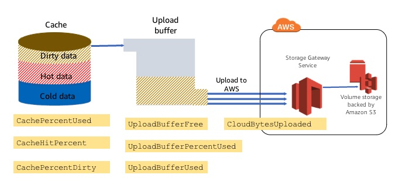

# Monitoring Storage Gateway Performance

## Metrics

* ReadBytes, WriteBytes - total bytes as measured from application server from/to gateway VM
* CloudBytesUploaded, CloudBytesDownloaded - gateway vm to AWS
* TimeSinceLastRecoveryPoint - may want to set an alarm if this exceeds a certain amount of time
* CachePercentUsed - file, cached volume, tape gateways
* CacheHitPercent - file, cached volume, tape gateways, (high is good)
* CachePercentDirty - file, cached volume, tape gateways
    * Set alarms on CachePercentUsed and CachePercentDirty

Per-volume monitoring: cache metrics

Review monthly cache averages for sizing and growth

## Data Transfer

* Dirty data async uploaded to AWS, parallel data uploads, compressed for tapes and volumes
* Rate of writes by app determines period of commits - high rates commit more frequently, low rates commit based on a timer you can set

## Metrics per Gateway Component/Function

High CachePercentDirty with low CloudBytesUploaded - network bottleneck, upload buffer disk problem?

Monitoring Cache and Upload Buffer

* Two types of storage - cache and upload
* App - writes stored in cache (cache always has the latest version), copied to upload buffer (all versions go through upload buffer, upload buffer goes to S3)
* App - reads from the cache, if not present pulled from s3 and stored in the cache
* Cache - monitor with CachePercentUsed, CacheHitPercent
* Upload buffer - need to upload in order to serialize the writes to volume in the cloud, periodically checkpointing
    * UploadBufferPercentUsed - want it to stay low
    * Full upload buffer full - passthrough state, all reads and writes use cache, no versions stored in upload buffer, can't do recovery points since versions not captured, recovery point objective impacted

## Troubleshooting a Storage Gateway

Read the [troubleshooting guide](https://docs.aws.amazon.com/storagegateway/latest/userguide/Troubleshooting-common.html)

Common On-Premises Issues

* IP address of gateway
* Network or firewall problems
* Gateway activation failure
* Removing local disks
* Improving bandwidth to AWS
* No throughput to/from gateway
* Trouble deploying the storage gateway

File Gateway ans File Share Issues

* File share is stuck on CREATING
* You cannot create a file share
* You cannot upload files into the S3 bucket

Volume Gateway and Volume Issues

* Volume is no configured
* Volume is irrecoverable
* Cached volume gateway is unreachable
* Volume status is passthrough
* Verify volume integrity and fix possible errors
* Volume's iSCSI target is not available

Tape Gateway and Vitrual Tape Issues

* Recovering a virtual tape from an unrecoverable gateway
    * Malfunctioning tape gateway
    * Malfunctioning cache disk
* Troubleshooting irrecoverable tapes
    * Recover data
    * No longer need an irrecoverable tape
    * A cache disk in your gateway fails
