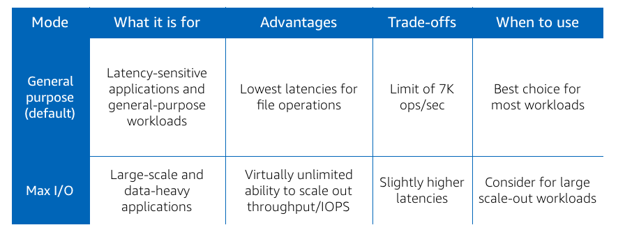
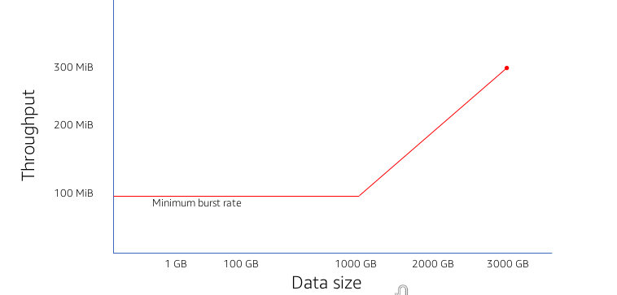

# Performance and Optimization

## Distributed data storage

* EFS is distributed across an unconstrainted number of servers.
* Avoids bottlenecks and constraints
* Drives high levels of aggregate IOPS and throughput
* Data distributed across availability zones

## Performance Modes

* Must choose at time of file system creation!

## Throughput and Size

* Uses credit system for bursting
* Need more throughput? Enable provisioned throughput mode.

### Bursting

* Bursting is the default mode, and recommended for the majority of workloads. Suited for spikey traffic.
* File systems can burst up to 100MiBs regardless of size. THroughput scales as the file system grows, will scale at the bursting rate of 100MiB/s per TiB of data stored up to the throughput limits of the default file system in the region.
* Can burst if you have a positive number of burst credits
* Monitor burst credits via BurstCreditsBalance metric

### Provisioned Mode

* Provision throughput independent of data stored.
* Billed in two diminsions: storage and throughput
* Increase as often as you need, decrease or switch once every 24+ hours

Performance modes whitepaper [here](https://aws.amazon.com/efs/choosing-your-performance-mode/)

* Earn credits when reading within burst rate limit, deplete when bursting.

### Maximizing Throughput

* Select the right instance type for your workload
* Distributed nature of EFS allows parallelizing file operations
* Leverage larger I/O size - amortizes the per-operation latency

## Monitoring

* Cloud watch metrics
    * BurstCreditBalance
    * ClientConnections
    * DataReadIOBytes
    * DataWriteIOBytes
    * MetadataIOBytes
    * PercentIOLimit
    * PermittedThroughput
    * TotalIOBytes

BurstCreditBalance and PercentIOLimit are the most important metrics to monitor.

Metrics math - query multiple metrics and use math expressions to create a new time series based on those metrics. For, if TotalIOBytes is given m1, define total throughput (MiB/s) as (m1/1048576)/PERIOD(m1)

Best Practices

* Test with general purpose performance mode - with that suffice?
* Start testing with bursting throughput mode
* Linux Kernel 4.0+
* Use EFS mount helper (NFS v4.1)
* Large IO size
* Multiple threads, multiple instances, multiple directories
* Monitor metrics
