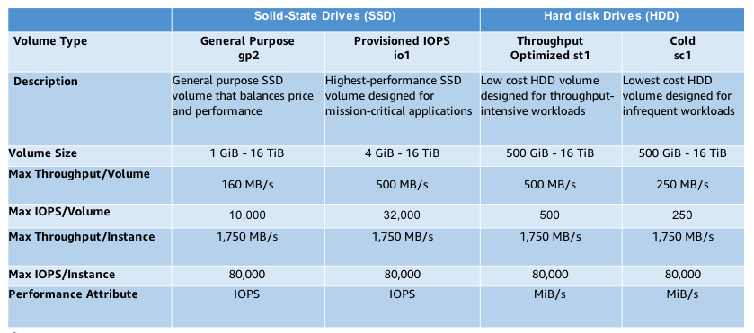

# Types of EBS Volumes

Two types: SSD and HDD

* SSD
    * Optimized for transactional workloads
    * Optimized for IOPS, low latency
    * Types: General purpose gp2, provisioned IOPS io1
* HDD
    * Optimized for large streaming workloads
    * Sequential workloads, high throughput
    * Types: Throughput optimized st1, cold HDD sc1

  

SSD Use Cases

* General purpose: Relational databases
* Provisioned IOPS: NoSQL databases (cassandra, mongoDB, couchDB)

HDD Use Cases

* Throughput optimized: Big Data, Analytics (kafka, splunk, hadoop, data warehousing)
* Cold: File/Media (CIFS/NFS, Transcoding, Encoding, Rendering)

How to Determine Type to Use

* Consider workload - IOPS or throughput more important
* If IOPS:
    * Greater than 80,000, or need < ms latency: EC2 instance store
    * Otherwise if cost is more important, pick gp2
    * If performance is more important, pick io1
* If throughput:
    * Small random IO or large, sequential I/O
    * If small random, you probably want SSD
    * If large sequential throughput:
        * If aggregate throughput > 1,750 MB/s, pick D2 or H1 optimized instance types
        * If aggregate throughput < 1,750, is performance or cost more important?
            * Performance: st1
            * Cost: sc1
* Uncertain of workflow: choose general purpose ssd gp2

General purpose GP2 satisfies almost all workloads:

* Baseline: 100-10,000 IOPS, 3 IOPS per GiB
* Burst: Up to 3000 IOS for volumes under 1 TiB
* Throughput: Up to 160 MiB.s
* Latency: single-digit ns
* Capacity: 1 GiB - 16 TiB

EBS Optimized Instance:

* Non-optimized have a shared network pipe for traffic to amazon services, internet, etc.
* EBS optimized instances has dedicated bandwidth for the attached EBS volumes
* C5: EBS-optimized burst
