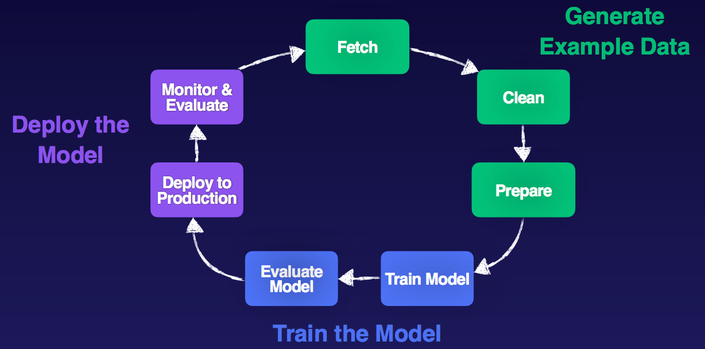

# Data Collection

## Machine Learning Cycle

Lather, rinse, repeat

## Data Collection Concepts

Before you begin...

* What type of generalization are we seeking? What problem are we trying to solve?
* Do we really need to use ML?
* How will my ML generalization be used?
* What data do we have to work with?
* How can i tell if the generalization is working?

| Good data | Bad data | Why it matters |
|------|-----|----|
| Large datasets | Small datasets | More data means better training |
| Precise attribute types, feature rich | Useless attributes, not needed for solving problem at hand | Need to train on relevant features |
| Complete fields, no missing values. | Missing values, null fields. | Models can skew results when data points are missing |
| Values are consistent | Inconsistent fields | Models like clean and consistent data |
| Solid distribution of outcomes | Lots of positive outcomes, few negative outcomes | Models cannot learn with skewed distributions of outcomes |
| Fair sampling | Biased sampling | Models will skew results with biased data |

Rule of thumb: 10x the number of points as you have features

Goal: build a data repository

## General Data Terminology

Terminology

* Datasets - the data we use in machine learning, a collection of data
    * input data, training/testing data
* Columns/attributes/features
* Rows/observations/samples/data points
* Form of data
    * Tables, json, comma separated, images, video, audio
* Structured - defined schema w/attribute names and data types
    * Relational databases, data in tables - rows and columns
* Unstructured data - no defined schema or structural properties
    * PDFs, images, video, audio, social media streams
* Semi-structured - too unstructured for relational data but has some organizational structure
    * NoSQL data, CSV, JSON, XML

Data stores

* Relational databases
    * Transactional
    * Strict schema
* Data warehouse
    * Collect data from many different sources in many different formats
    * Landing area and cleaning before it gets stored in the data warehouse (processing done on import)
    * Data classified/stored with the user in mind
    * Ready to use with BI tools - query and analysis
* Data Lakes
    * Store mass amounts of unstructured data, no processing before it goes in the data lake
    * Historical data, data we don't know what to with yet
    * Many different formats
    * Processing done on output (schema on read)

## Machine Learning Terminology

* Labeled data
    * already know what the target attribute is
    * Examples
        * spam/not spam emails
        * labeled handwritten digits
        * housing prices
        * tumor images/benign images
        * customer churn data
        * fraudulent/non-fraud credit card transactions
        * tagged audio/video
* Unlabeled
    * data that has been collected with no target attribute
    * examples
        * customer info
        * news articles
        * log files
        * surveillence videos
        * tweets
        * block posts
        * web traffic access
        * stock prices

Features

* Categorical
    * aka nominal
    * associated with a group, qualitative, discrete, unordered
* Ordinal
    * Like categorical except ordered
* Continuous
    * continuous features that are values expressed as a number
    * quantitative
    * infinite

Text Data (Corpus Data)

* Collected from text
* Used with NLP, speech recognition, etc

Ground Truth

* Datasets that refer to factual data that have alerady been observed or measured. This data has  successfully been labeled and can be trusted as truth.

Image Data 

* Datasets with tagged images
    * MNIST data handwritten characters
    * Image Net
    * Applications like facial recognition, action recognition, object detection, handwriting and character recognition

Time Series Data

* Captures changes over time 
    * Stock market data
    * Telemetry from IoT

## AWS Data Stores

S3

* Unlimited data storage that provides object based storage for any type of data.
* Go to place for storing machine learning data.
* Some s3 details
    * 0 to 5 TB object size
    * Stored in buckets
    * Universal namespace for bucket names
    * Endpoint styles
        * `s3-<region>-amazonaws.com/<bucketname>` (path style, ends sept 2020)
        * `<bucketname>.s3.amazonaws.com `(virtual hosted style)
* How to get data into s3
    * via console
    * sdks, cli

RDS

* Relational database service
* aurora, postgres sql, mysql, maria db, oracle, sql server engines

DynamoDB

* NoSQL, key-value pairs
* Good for schemaless, unstructured/semi-structured data

Redshift

* Fully managed, clustered petabyte data warehouse solution
* Use sql tools to query data in redshift
* Columnar storage
* Spectrum can query s3 data via redshift and quicksight as well

Timestream

* time series database system

Document DB

* Place to migrate mongo db data

## AWS Migration Tools

Data pipeline

* process and move data between different aws compute and storage services
* good for moving data from onprem to aws too
* Built in activity objects
    * copy, emr, hive, sql, etc
* Run on schedule or on demand
* Can also do transformation

Database Migration Service

* migrate data between different database platforms
* can also output the results onto s3
* homogenous and heterogenous migration (e.g. my sql to my sql, oracle to postgres)

AWS Glue

* Fully managed ETL service
* Data catalog with databases and tables
* Crawlers used to derive schema, data types, etc
* Classifiers are used by the crawlers
    * Several builtin, can use custom classifier

Examples of getting data into s3

* Postgress data to s3: data pipeline using sql activity
* Unstructured log files in s3: AWS glue using custom classifier, output to s3
* Clustered redshift data
    * AWS data pipelime using unload comand to return query results into csv in s3
    * AWS glue create catalog describing data and load it into s3
* On premise mysql: DMS can load the data in csv onto s3

## AWS Helper Tools

Elastic Map Reduce

* Fully managed hadoop cluster ecosystem that runs on AWS EC2 cluster
* Use the open source tools that are part of the hadoop ecosystem (spark, presto, hive, hadoop fs, etc)

Athena

* Serverless platform that lets you use SQL queries on s3 data
* Set up catalog with AWS glue
* Query against glue tables

## Data Collection Exam Tips

* Read and watch the additional resource materials

Resources:

* https://d1.awsstatic.com/whitepapers/Size-Cloud-Data-Warehouse-on-AWS.pdf
* https://d1.awsstatic.com/whitepapers/Big_Data_Analytics_Options_on_AWS.pdf
* https://d1.awsstatic.com/whitepapers/enterprise-data-warehousing-on-aws.pdf
* https://d1.awsstatic.com/whitepapers/Migrating_to_Apache_Hbase_on_Amazon_S3_on_Amazon_EMR.pdf
* https://d1.awsstatic.com/whitepapers/RDS/AWS_Database_Migration_Service_Best_Practices.pdf
* https://www.youtube.com/watch?v=QZ4LAZCbsrQ
* https://www.youtube.com/watch?v=v5lkNHib7bw
* https://aws.amazon.com/blogs/big-data/build-a-data-lake-foundation-with-aws-glue-and-amazon-s3/