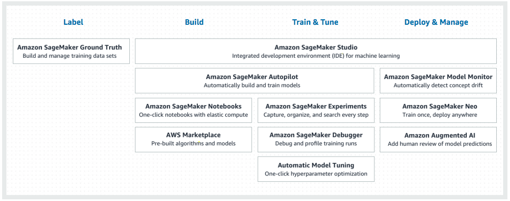

# Modeling

From the machine learning cycle...

* We've fetched, cleaned, and prepared our data
* Now it is time to train and evaluate models

## Modeling Concepts

Taking a problem or challenge as described by lots of data, adding a machine learning algorithm and through computation, tying to figure out a mathematical forumula that can accurately generalize about that problem.

Components

* Model - want to produce generalization, e.g. based on my training here's what I think the outcome is given this new situation
* Data
* Algorithm - right algorithm
* Computational Power
* Feedback loop - for model, for suitability of data

Developing a Good Model

* What type of generalization are we seeking?
    * Forecasting a number? Deciding if customer more likely to choose option A or option B? Detect a quality defect in a machined part?
* Do we really need machine learning?
    * Can a simple heuristic work? IF THEN logic? Regression forumla or lookup function?
* How will my ML generalizations be consumed?
    * Do I need to return real-time results or can I process the inferences in batches? Will consumers be applications via API calls or other systems which will perform additional processing on the data?
* What do we have to work with?
    * What sort of data accurately and fully captures the inputs and outputs of the target generalizations? Do we have enough data?
* How can I tell if the generalization is working?
    * What method can I use to test accuracy and effectiveness? Should my model have higher sensitivity to false positives or false negatives? How about accuracy, recall, and precision?

Types of Models

|  | Supervised Learning | Unsupervised Learning | Reinforcement Learning |
| -- | -- | -- | -- |
| Discrete | Classification | Clustering | Simulation-based optimization |
| Continuous | Regression | Reduction of Dimensionality | Autonomous |

Choosing the Rght Approach

| Problem | Approach | Why |
| -- | -- | -- |
| Detect whether a transaction if fraud | Binary classification | Only two possible outcomes: fraud or not fraud |
| Predict rate of deceleration of a car when brakes are applied | Heurisric approach (no ml needed) | Well known formulas involving speed, inertia and friction to predict this |
| Determine the most efficient path of surface travel for a robotic lunar rover | Simulation based reinforcement learning | Must figure out the optimal path via trial, error and improvement |
| Determine the breed of a dog in a photo | Multi-class classification | Which dog breed is the most associated with the picture among many breeds |

Cascading Algorithms

* Sometimes we have to stack algorithms
* Example: what is the estimated basket size of shoppers who respond to our email promotion?
    * Remove outliers - random cut forest
    * Identify relevant attributes - PCA
    * Cluster into groups - KMeans
    * Predict basket size - Linear learner

Confusion Matrix

| | Actual True | Actual False |
| -- | -- | -- |
| **Predicted True** | Predicted correctly | False Positive |
| **Predited False** | False negative | Predicted correctly | 

Problem: Is a financial transaction fradulant?

| | Fraud | Not Fraud|
| -- | -- | -- |
| **Predicted Fraud** | Happy bank. Happy Customer. No money lost.| Happy bank. Angry customer. No money lost.|
| **Predited Not Fraud** | Angry bank. Angry customer. **Money lost.**| Happy bank. Happy customer.  No money lost. |

Here is you are a bank you want to avoid where you predicted no fraud but there is fraud. Bank is ok with more false positive than false negatives as that reduces their exposure to fraud. We'll look closely at *recall*.

Example: is email spam?

| | Spam | Not Spam|
| -- | -- | -- |
| **Predicted Spam** | Spam blocked| Legitimate emails blocked|
| **Predited Not Spam** | Spam gets through | Legitimate emails get through |

Set the evaluation approach to error on the side of caution to ensure legitimate emails are not blocked. Watch *precision* of the model closely.

## Data Preparation

Bloom's taxonomy 

* Professional level certification objective - evaluate (justify a stand or decision), analyze (draw connections among ideas), apply (use info in new situations).
* Model analog - we want our models to generalize, not memorize.

Use most data to train, but reserve some data to see if the model has really learned to generalize and not just repeating what we've already shown it.

* 70 - 80% training data
* 20 - 30% testing data
* Want the same distribution between training and test data.
    * Randomize the data so it has the same distribution
    * Split
    * Train
    * Test

Time series data

* Need to be representative - random points or segments not useful
* Slice off the last few time segments (for example the last two months)

Movie Review Example

* Sequential split - what is it was presorted by genere

K-Fold Cross-Validation Method

1. Randomize
2. Split
3. Fold
4. Train
5. Test
6. Repeat

* Look the error rates for the different rounds - if error rates differ significantly across rounds then the data was not as random as you may have thought

## SageMaker Modeling

Mechanical Turk

* Human labeling - emdedded in ground truth
* Many mechanical turk tasks are now performed by AI services

SageMaker

* Ground truth
* Notebook
* Training 
* Inference

Submitting jobs to SageMaker

* Console
* SageMaker SDK
* Jupyter 
* Spark

In general training and test datasets go in s3, sage maker reads it from there.

* Randomize/shuffle to get similar distributions in training and test sets
* Move label into first column, drop column titles
* Upload dataset to s3 using appropriate format - CSV with test/csv content type on upload
    * For unsupervised learning algorithms, include spec of absense of label in Content-Type, e.g. test/csv;label_size=0

For optimal performance, the optimized protobug recordIO format is recommended.

* Using this format, we can take advantage of Pipe mode
* With recordIO and Pipe mode, data can be stremed from s3 to the learning instance requiring less EBS space and faster start-up

CreateTrainingJob API

* A couple options...
    * High level python library provided by Amazon SageMaker
    * Also in the SDK for python
* Specify the training algorithm
* Supply algorithm-specific training parameters
* Specify the input and output configuration

## SageMaker Training

Why GPUs?

Performance

* Most performance - ASIC
* GPU, FPFA - middle
* CPU 0 least performance

Flexibility

* ASIC least flexible
* FPGA - middling
* GPU, CPU most flexible

Cost

* FPGA, ASIC most expensive
* GPU
* CPU - least

Machine Learning

* Use GPU amd CPU to do model training and development
* Could conceivably create a ASIC with the model burned in (months or years) or program it into a FPGA device (hours or days).

Training

* ECR has training and inference images
    * CreateTrainingJob API call uses training images
    * CreateModel API call uses inference images
* Training is often compute intensive, inference may need less
* Image names
    * channel helps keep straight training vs inference
    * See [Algorithms Provided by Amazon SageMaker: Common Paramters](https://docs.aws.amazon.com/sagemaker/latest/dg/sagemaker-algo-docker-registry-paths.html)
* Can create your own container images as well, upload in ECR and reference it
* Deployment
    * Selects container, can get data from S3 or front it with API gateway

CloudWatch

* Logs arguments provided, errors during training, algorithm accuracy stats, time to compolete a cycle
* Common errors - errors specifying hyperparametes, invalid value for hyperparameter, incorrect protobuf file format

Training with Spark

* Use SageMaker Spark SDK
* SDK can convert spark data frame format to protobuf
* From there inputs from s3, training job output to s3

## Exam Tips

Model Design

* Select a model that is a good fit for the objective
* Choose the proper ML approach for your objective (regression, binary ckassification, etc)
* Choose appropriate evaluation strategies for your model
* Steps for training a model

Data Prep

* Understand concepts of training data and testing data
* Identify potential biases introduced in an insufficient splut strategy
* Know when to use sequential splits (time series) vs randomized splits, know what additional measures could be used to increase training data value.

Model Training

* Know the different options for model training
    * SageMaker console, apache spark, custom code via SDK, Jupyter Notebook.
* Be familiar with default data types SageMaker algorithms support and the recommended format for best performance
* Know the difference between a Hyperparameter and Parameter
* Understand the repository and container image concept for SageMaker training
* Understand the process if you wish to provide your own algorithm
* Understand the process for using apache spark to interact with SageMaker

## Modeling Lab

The problem: deploy a network of 10 sensors across the globe, in the most likely places to sight UFOs.

* What type of generalization are we trying to make?
* Do we have enough data? What does our data look like?
* What algorithm can help us solve this problem?
* Where should we launch the sensors?

Data Set [here](https://github.com/ACloudGuru-Resources/Course_AWS_Certified_Machine_Learning/blob/master/Chapter6/ufo_fullset.csv)

Use K-Means

* Set K to 10 - we want 10 locations
* Get latitude and longitude, map using quicksight

