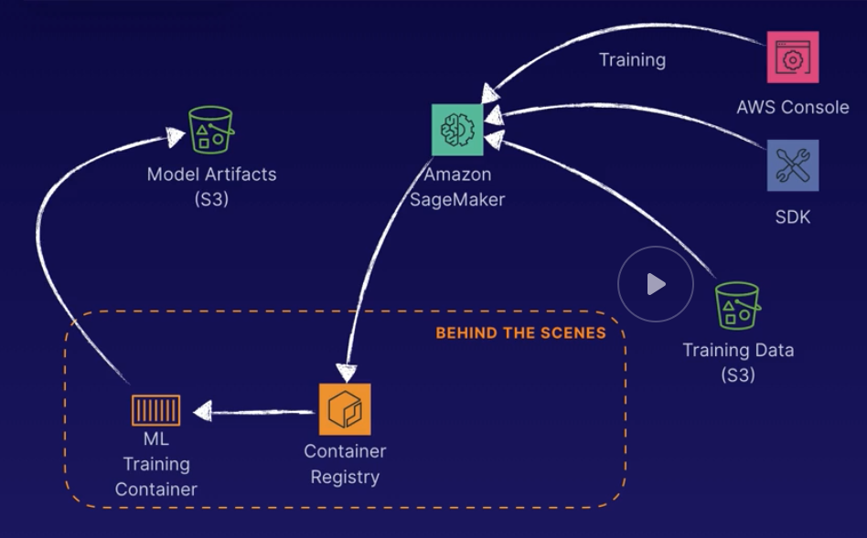
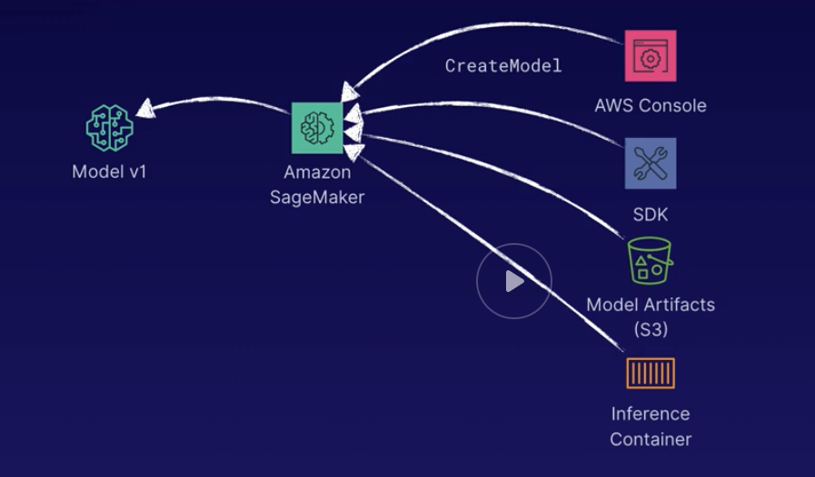
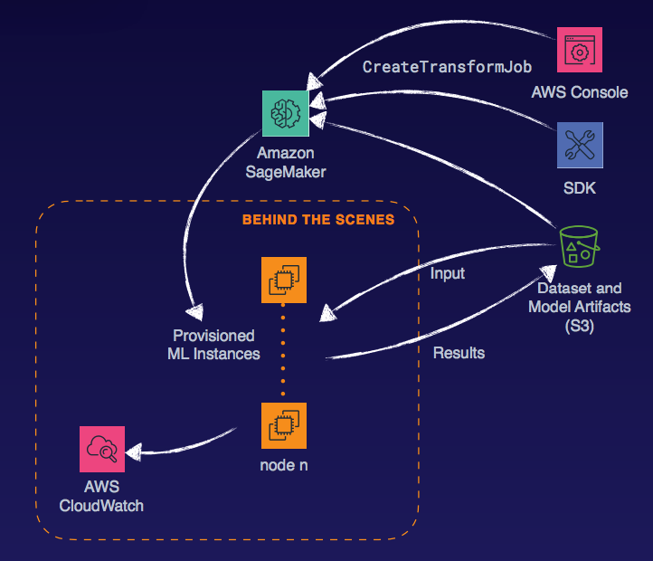

# Implementation and Operations

## Introduction

Machine learning cycle - covers deploy to production, monitor and evaluate post deployment

## Concepts

| | Offline Usage | Online Usage |
| -- | -- | -- |
| What | Makes inferences on datasets in batch and returns results as a set | Makes inferences on demand as the model is called and returns results immediately |
| Why | Entire dataset is needed for inferences; pre-process data before using as an input for another model | Need instant response when endpoint is called via app or service |
| When | - Predictive models with large historic dataset inputs  -Feature engineering for a follow on model | - Real-time fraude detection - Autonomous machines |

Types of Deployments

| | Big Bang | Phased Rollout | Parallel Adoption |
| -- | -- | -- | -- |
| Time | Least amout of time | More time | Most amount of time |
| Risk | High | Low | Low |
| Cost | f(Risk, Time) | f(Risk, Time) | f(Risk, Time) |

Sometime risk is amplified in parallel adoption due to concurrency such as synchronization issues, multiple processes, temporary integrations, etc.

Rolling Deployment

* Rather than upgrade all the resources at once, the upgrade is done one by one to minimize downtime.

Canary Deployments

* Deploy a new version into production to see how it works, route small amount of traffic to it.
* Use route 53 to distribute traffic

A/B Testing

* Deploy a new version into production and configure a set amount of new inbound traffic to use the new (B) version, recording follow-on data about the outcome of those who used the new version. Once enough data is collected, make a decision on whether to fully deploy the new version or make adjustments.
* SageMaker hosting can do this

CI, CD, and More

* Continuous Integration - merge code changes back to main branch as frequently as possible with automated testing as you go.
* Continuous Delivery - you have automated your release process to the point you can deploy at the click of a button.
* Continuous Deployment - each code change that passes all stages of the release process is released into production with no human intervention required.

## AI Developer Services

AWS AI Stack

* AI Services - for app developers, no ML experience required
    * Amazon Comprehend
    * Amazon CodeGuru
    * Amazon Lex
    * Amazon Forecast
    * Amazon Polly
    * Amazon Rekognition
    * Amazon Textract
    * Amazon Transcribe
    * Amazon Translate
    * Amazon Kendra
    * Amazon Personalize
    * Amazon Fraud Detector
* ML Services - ML developers and data scientists
    * SageMaker
        * Ground Truth
        * Training
        * Notebooks
        * Hosting
        * Algorithms
        * Marketplace
* ML Frameworks and Infrstructure - ML researchers and academics
    * Frameworks - mxnet, tensortflow
    * Interfaces - gluon, keras
    * Amazon Greengrass
    * Amazon EC2
    * AWS Deep Learning AMIs

AWS Developer Services

* Easy to use with no ML knowledge required
* Scalable and robust
* Redundant and fault tolerant
* Pay per use
* REST API and SDK

Amazon Comprehend

* Natural language processing (NLP) service that finds insights and relationships within text
* Use case example: sentiment analysis of social media

Amazon Forcast

* Combines time-series data with other variables to delivery highly accurate forecasts
* Example usage: forecast seasonal demand for a specific color of shirt

Amazon Lex

* Build conversational interfaces that can understand the intent and context for natural speech
* Example use: create a customer service chatbot to automatically handle routine requests

Amazon Personalize

* Recommendation engine as a service based on demographic and behavioral data.
* Example use: Provide potential upsell products at checkout during a web transaction.

Amazon Polly

* Text-to-Speech service supporting
multiple languages, accents and
voices.
* Example use: Provide dynamically generated
personalized voice response for
inbound callers.

Amazon Rekognition

* Image and video analysis to parse and
recognize objects, people, activities
and facial expressions.
* Example use: Provide an additional form of employee
authentication though facial recognition
as they scan an access badge.

Amazon Textract

* Extract text, context and metadata
from scanned documents
* Example use: Automatically digitize and process
physical paper forms

Amazon Transcribe

* Speech-to-Text as a service
* Example use: Automatically create transcripts of
recorded presentations.

Amazon Translate

* Translate text to and from many
different languages
* Example use: Dynamically create localized web
content for users based on their
geography.

Amazon CodeGuru

* Amazon CodeGuru is a developer tool powered by machine learning that provides intelligent recommendations for improving code quality and identifying an application’s most expensive lines of code
* Amazon CodeGuru Profiler helps developers find an application’s most expensive lines of code along with specific visualizations and recommendations on how to improve code to save money.
* Amazon CodeGuru Reviewer uses machine learning to identify critical issues and hard-to-find bugs during application development to improve code quality.

Amazon Kendra

* Amazon Kendra is a highly accurate and easy to use enterprise search service that’s powered by machine learning. Kendra delivers powerful natural language search capabilities to your websites and applications so your end users can more easily find the information they need within the vast amount of content spread across your company.

Amazon Fraud Detector

* Amazon Fraud Detector is a fully managed service that uses machine learning (ML) and more than 20 years of fraud detection expertise from Amazon, to identify potentially fraudulent activity so customers can catch more online fraud faster.

## SageMaker Deployments

Types of Deployments

* Batch - SageMaker offline
* Online - SageMaker hosting services

SageMaker Hosting Services

1. Create a model. This is the inference engine that will provide predictions for your endpoint.
2. Create an endpoint configuration. Defines the model to use, inference instance type, instance count, variant name and weight. Also called a production variant.
3. Create an endpoint. Publishes the model via the endpoint to be called by the SageMaker API InvokeEndpoint method.

Training

* Artifacts for the model are written to s3

Inference

* Reference the model artifacts and the container image to use (for the algorithm)

Retraining

* Retrain model using additional data aquired while in production
* Can have multiple models

Endpoint Configuration

* Can have different variations for multiple model versions deployed simultaneously
* Traffic weights are assigned to each variant/model version, assigned using the initial_weight parameter.
* Initial Weights controls the amount of traffic going to a particular production variant.
* Percent of traffic = variant weight / sum of all weights (like route 53 weighted traffic)

Batch Transforms

Inference Pipelines

* Sometimes we need to chain together algorithms and feature engineering steps.
* For example, for the problem "What is the estimated basked size of shoppers who respond to our email promotion?"
    * Remove outliers -> Identify relevant attributes -> Cluster into groups -> Predict basket size
    * Random cut forest -> PCA -> K-means -> Linear learner
* SageMaker Infererence Pipelines
    * A SageMaker model composed of a sequence of two to five containers which can process data as a flow. These can be built-in algorithms or your own custom algorthms in Docker containers.
    * Can be used for both real-time inference and batch transform
    * All containers deployed to the same EC2 instance for local speed

SageMaker Neo

* Enables a simplified way to optimize machine learning models
for a variety of computing architectures such as ARM, Intel and
nVidia processors.
    * Avoid having to do low level optimizations for different target architectures for deployment
* Consists of a compiler to convert the machine learning model
into an optimized binary and a runtime to execute the model on
the target architecture. 

Elastic Inference

* Speeds up throughput and decreases latency of real-time
inferences deployed on SageMaker Hosted Services using
only CPU-based instances but much more cost-effective than a
full GPU instance.
* Must be configured when you create a deployable model and
EI is not available for all algorithms yet.

Autoscaling SageMaker Models

* Similar to EC2 autoscaling
* Dynamically add and remove instances to a production variant
based on changes in workload.
* You define and apply a scaling policy that uses a CloudWatch
metric and target value such as InvocationsPerInstance.
* Specify min and max instances, target metric, cooldown for scale in and scale out.
* In cases where traffic is very heavy then non-existent, you may have to force a scale-in because CloudWatch does not emit zero records. The absence of such records will not trigger a scale-in event.

## Other Model Deployment Options

* Amazon Elastic Container Service
* Amazon EC2
* Amazon Elastic Map Reduce
* On-Premises

The basic approach

* Start with the typical model creation process which produces the model artifacts
* With ECS, use the interence container for the algorithm along with the model artifacts in s3
* With EC2, use the s3 artifacts along with the deep learning AMI. Spin up an instance type appropriate for the algorithm.
* EMR - deploy using spark
    * Use existing spark pipelines for preprocessing data
    * Potentially more cost effective for non-gpu workloads
    * Leverage existing hadoop landscape and tools
* Deploy locally
    * Use mxnet or tensorflow and the standard model building process, writing model artifacts to s3
    * Download the model artifacts to on-premise storage, run a tensorflow or mxnet application on premises.

## Security

Aspects

* Visibility
    * VPC endpoints, NACLs, security groups
* Authentication
    * IAM
* Access Control
    * IAM (roles, policies, groups)
* Encryption
    * KMS

AWS ( VPC ( NACL ( Security group ( EC2

VPC Endpoint

* A way to access other AWS services using the AWS network without
having to send traffic over the public internet
* VPC Endpoints increase security and allow AWS services to
communicate privately and reliability.
* Two types: Interface and Gateway
    * Gateway Endpoints are only available for S3 and
DynamoDB and differ because they use a route table entry versus a
private DNS entry that the Interface Endpoints use. In the end, they
both fulfill the same function
* Private link - service behind interface vpc endpoints

Notebook Instances

* Internet-enabled by default. By default, SageMaker notebook
instances are internet-enabled. This
allows for download and access to
popular packages and libraries.
* Can Disable Internet Access. Internet access may represent a
security concern to some, so you can
disable direct Internet access.
However, for training and hosting
models, you will need a NAT gateway,
routes and security groups that permit
Internet access.
* Designed for Single User. Notebook instances provide the
user with root access for installing
packages. Best practice is one
user per notebook instance. We
can restrict access to users or roles
via IAM policy.

IAM Policies

| | Identity-based Policy | Resource-based Policy |
| -- | -- | -- |
| What | A permissions policy attached to IAM identities | A permissions policy attached to a resource |
| Why | Allow or denty access to a role or a user | Allow or denty access to a resource |
| When | Only allow user mary access to the notebook instance Marys_Notebook | Restrict R/W access to an S3 bucket by specific AWS accounts |

Encryption

* At rest - KMS
* In transit - certs, TLS

Endpoint Service from the Outside

* API gateway with a custom domain
* Invokes a lambda 
* Lambda invokes the inference endpoint

## Monitor and Evaluate

Cloudwatch with Amazon SageMaker

* Wide Variety of Metrics.
Endpoint Invocation, Endpoint
Instance, Training, Transform and
Ground Truth metrics available in
addition to algorithm-specific metrics.
* Near Real-Time
Most SageMaker-specific metrics are
available at a 1-minute frequency for
quick reactions
* Metrics Available for 15 Months
Statistics are kept 15 months to
provide plenty of historical information 
* Metrics are collected and sent every
five minutes for training and prediction
jobs.

Logs

* Notebooks integrated with cloudwatch (stderr, stdout)

Re-Training

* Overtime accuracy can decline
* May want to monitor the metric, file and alarm to retrain, etc.

CloudTrail

* Log API Access
Captures any API calls made by or on
behalf of SageMaker within your
account
* Last 90 Day’s Events
By default, the last 90 days of events
are visible in CloudTrail Event History.
* Can Be Kept Indefinitely
You can setup a CloudTrail to store
logs on S3 to reference for as long as
you’d like, as well as practice lifecycle
processes like archive to Glacier.
* Query with Amazon Athena
For advanced queries, you can use
Amazon Athena to query and analyze
data directly from S3.

## Implementation and Operations Exam Tips

Concepts

* Understand the difference between offline and online usage for models
and when you might use each.
* Have a high-level understanding of the types of deployments and
respective pros and cons.
* Understand A/B Testing and how it might be used to introduce a newly
updated model.
* Understand the concepts behind continuous integration, continuous
delivery and continuous deployment.

AI Developer Services

* The AI developer services provided by AWS are scalable,
fault-tolerant and ready to use.
* Know each service, its purpose and in what use-cases they might be
used.
* Experiment with each service via the Console or CLI to get a feel for
what it does and how it works.

Amazon SageMaker Deployments

* Know the three main steps in creating a deployment using SageMaker
Hosting Services.
* Understand ProductionVariants and how they can be used to introduce
new evolutions of your models.
* Know how to calculate the percentage of traffic given weights for each
production variant.
* Understand the purpose and limitations of Interface Pipelines,
SageMaker Neo, Elastic Inference, Auto-Scaling and Cool Down
* Recall best practice suggestions for high availability with SageMaker.

Other ML Deployment Options

* Know the four other options for ML deployment aside from SageMaker
Hosting Services and when you might chose them instead of
SageMaker.

Security

* Be familiar with using VPCs, NACLs, SGs, IAM and KMS to secure
Amazon ML and SageMaker resources.
* Understand a VPC Endpoint and why it increases security.
* Know that Notebook Instances are Internet-enabled by default but this
can be disabled given certain conditions and introducing limitations.

Monitor and Evaluate

* Understand the difference between CloudWatch and CloudTrail.
* Know that CloudWatch has a limited storage while CloudTrail can have
unlimited storage if you log to an S3 bucket.
* Understand how you might use metrics to trigger events like
re-training.

