# Data Engineering with AWS for Machine Learning

## Data Characteristics

* Structured - relational, predefined schema, relationships
* Semi-structured - json, xml, key-value, document
* Unstructure - not structure at all, heterogenous, object storage

Batch and Stream Processing Characteristics

* Batch - data scope is querying or processing over all the data in the data set
    * Complex analysis
    * Data size is large batches
    * Performance is latencies in minutes to hours

* Stream
    * Higher velocity data
    * Continous data, processed over a small time window
    * Queries done on most recent data
    * Latencies in seconds or subsecobds

Application Characteristics

* Number of users
* Data volume
* Locality
* Performance
* Request rate
* Access
* Scale
* Economics
* Developer access

For the Exam

* Data characteristics help you decide on the repository services to us
* Batch and stream processing characteristics help you decide the services to use for ingestion
* Application characteristics help you decide the storage services to use

## Typical Dataflow for ML on AWS

Modern data analytics pipelines

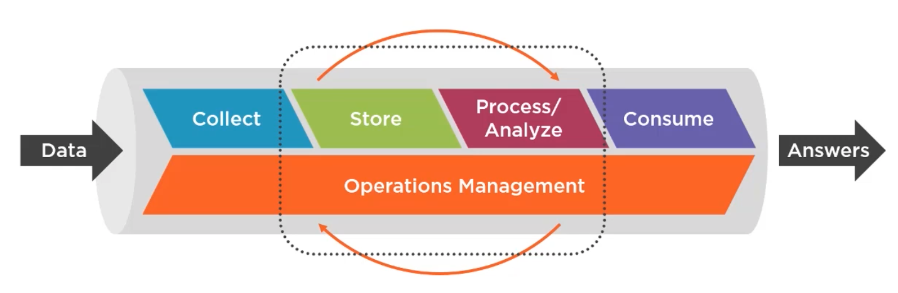

Data movement - extract from the source and ingest into a destination

Modern data workflow architecture

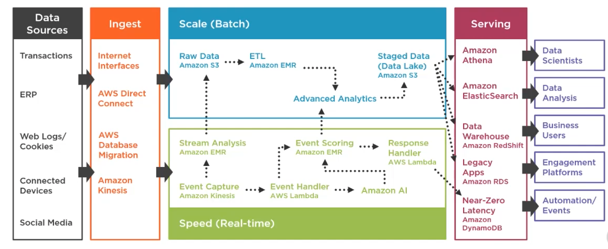

## Data Storage Options on AWS

Amazon S3

* Amazon S3 Data Lakes
* Query in place services for big data analytics
* Primary data repository for machine learning tools
* S3 access points simplifies data sharing
* S3 batch process s3 objects in a simple straight forward manner
* S3 event notifications

Partitioning Data in Amazon S3

* Objects in buckets
* Object key is full path to object
* Partitioning is done on the path
    * By date is column
    * Tailor to your data access patterns
* Up to 5 TB object size, up to 10 tags

S3 Storage Classes

~

* Object lifecycle management
    * Transition actions - change storage class
    * Expiration actions - once expired AWS will delete the object

S3 Security

* Encryption - client-side, server-side
    * Server Side
        * SSE-S3: encrypts s3 objects using keys handled and managed by AWS
        * SSE-C: you manage encryption keys and provide them on upload and download, amazon uses the key to encrypt and decrypt
        * SSE-KMS: customer manages the data key using KMS, higher security, audit train

Security

* User based or resource based
    * User: IAM user policies
    * Resource
        * Bucket policies
        * Object ACLs
        * Bucket ACLs

VPC Endpoints for S3

* Keep traffic from the VPC off the public internet, plus no need for gateway, etc.
* Access points only via virtual host style endpoints

EFS for Machine Learning

* Personalized environments: notebook files, training data, model artifact
* SageMaker integrates for training jobs

Amazon FSx for Lustre

* S3 integration: file system linked to an S3 bucket
* Amazon sagemaker - traiing jobs
* AWS Batch integration
* AWS parallel cluster integration

Elastic Block Store

* Multi-attach capablity, use for distributed training on up to 16 instances, 128 GPUs

Cost Effectiveness

* produce, class or tier, how much data, what region
* use the calculator to compare

Exam Tips

* S3 - stores objects, globally unique bucket names, max 5 TB, object keys = path, partitioning on the path, life cycle rules, vpc endpoints
* EFS - speeds training jobs
* EBS - higher availability

## Database Options for Machine Learning on AWS

### Amazon RDS

Fully managed scalable relational database service

* 6 engines
* Can connect to RDS databases from Jupyter Note using pymysql, etc.

### Amazon Aurora

Relational database built for the cloud

* Natively integrated with SageMaker and Amazon Comprehend
* Use SQL to apply machine learning to data in Aurora
    * Amazon Aurora Machine Learning

### DynamoDB

Serverless non-relatoinal, keu value store with single-digit millisecond response data

Analyze data in DDB using SageMaker for realtime predictions

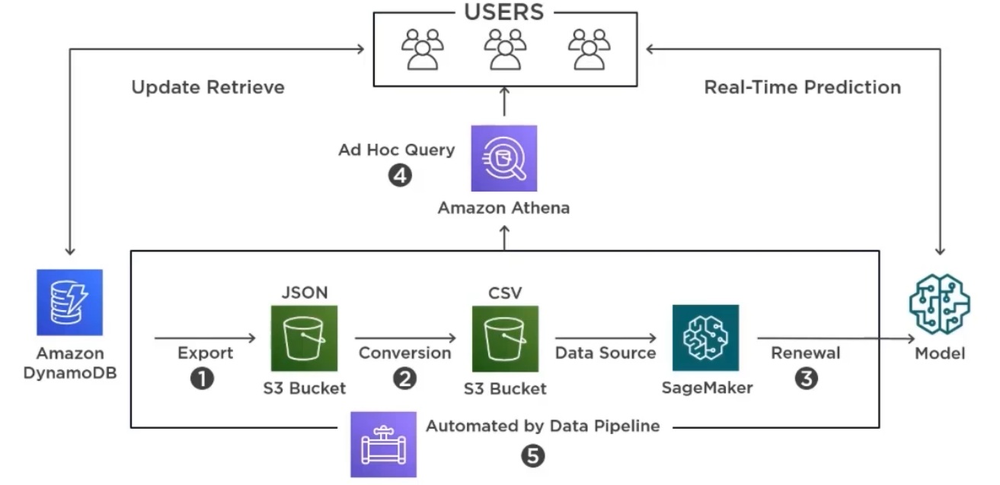

### Amazon Redshift

Multi-parallel processing data warehouse

Can do JDBC connections to redshift from Jupyter notebooks

* Use psycopg2, e.g. !conda install --y -c anaconda psycopg2

### Amazon Document DB

Fast, scalable non-relational schema-free data for mongodb workloads

* Unique distributed data storage on s3

Amazon Translate and Transcibe output JSON

* Makes document DB a natural database to integrate with

### Exam Tips

Know

* The different database offerings from Amazon at a high level
* Different integration scenarios for machine learning use cases

## Using a Data Warehouse or Data Lake for ML on AWS

Data warehouse vs Data Lake

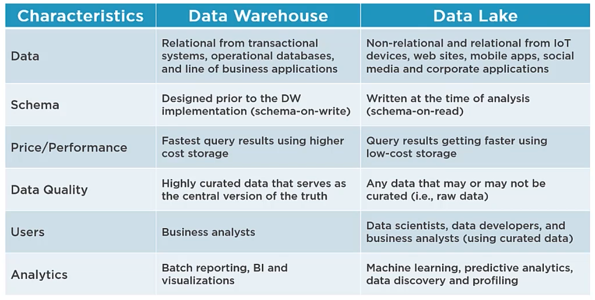

Data Lake Architecture

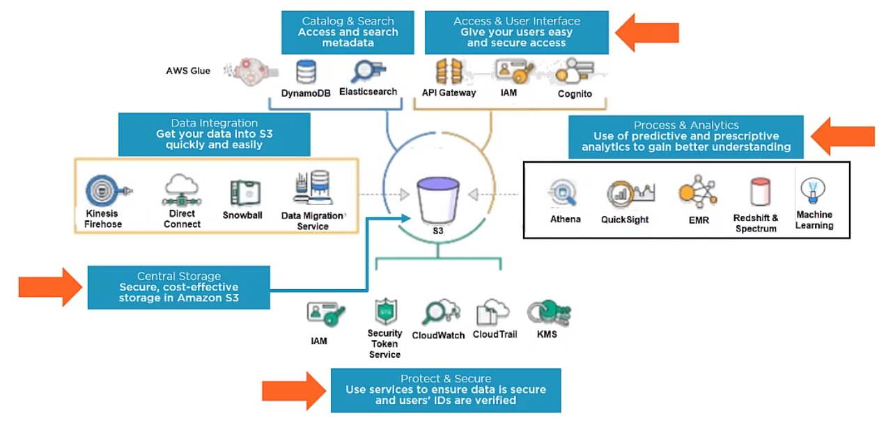

### Immutable Logs and Materialized

Immutable logs and materialized views are the foundation for s3 data lakes

Realtime analytics architecture

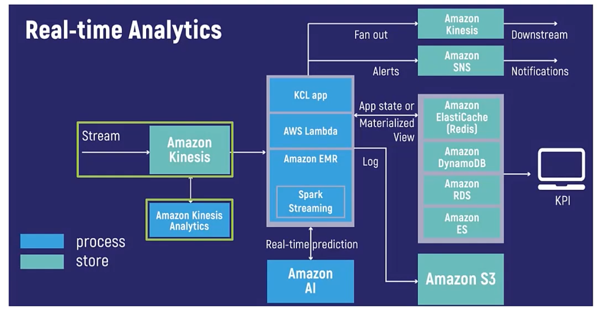

Batch and interactive analytics AI'd

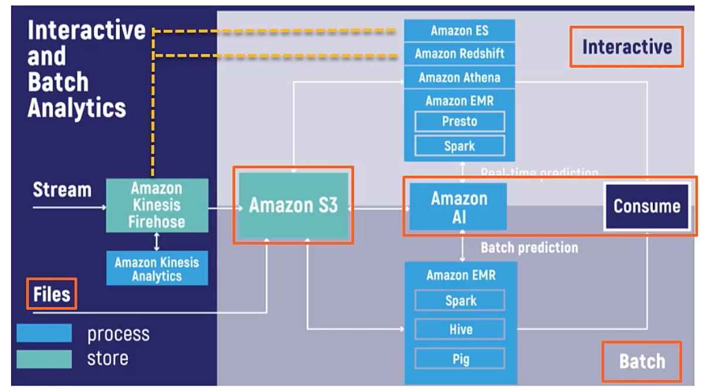

Batch, Interactive, Stream, and Real-time Analytics on an S3 Data Lake

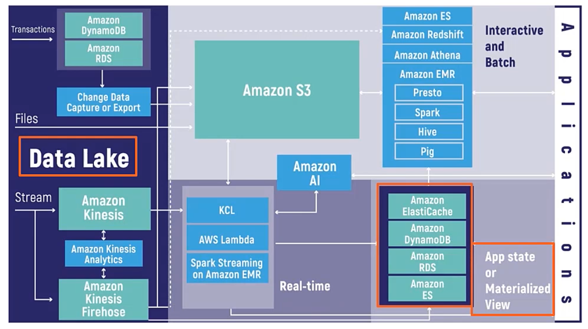

### Amazon Lake Formation

Ingest and cleaning

* What data sources
* S3 locations
* Map data to s3 locations
* ETL to load and clean the data

Security

* Configure access policies
* Metadata access policies
* Access from analytical services

Analtics

* set up the analytics capabilities, etc.

AWS Lake Formation Solution Stack

* Instantiate a common architecture
* Ingest and clean
    * Blueprints simplify ingest
    * ML transforms for data cleaning
* Security
    * Real time monitoring and integrated auditing
    * Centralized permissions
* Analytics  & ML
    * Comprehensive portfolio of integrated tools
    * Right tool for the right job

Lake formation built on top of glue

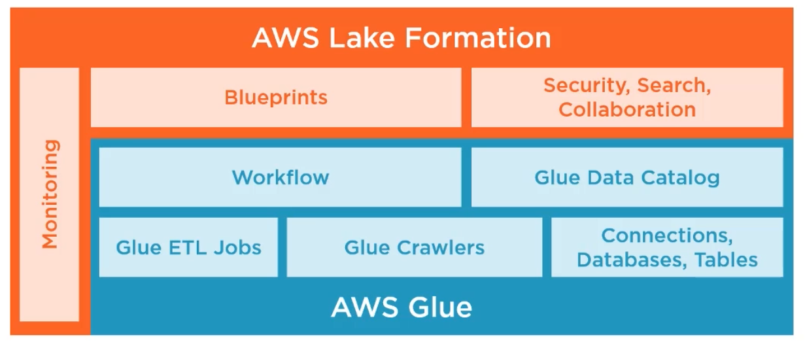

### Redshift

Some features...

* AQUA - accelerated query optimizer cache for redshift
* Spectrum
* Federated Query (against postgres and aurora in addition to redshift)

### Data Warehouse vs Data Lake

Data warehouse

* Relational data
* Schema on write
* Curated data
* Batch reporting, BI, visualizations

Data Lake

* Non-relational
* Schema on read
* Raw data
* ML, predictive analytics, data discovery/profiling

### Exam Tips

* DL and DW are the primary way to get data into machine learning services
* Differences between DW and DL
* Data lake advantages

From AWS

> A data lake is a centralized repository that allows you to store all your structured and unstructured data at any scale. You can store your data as-is, without having to first structure the data, and run different types of analytics—from dashboards and visualizations to big data processing, real-time analytics, and machine learning to guide better decisions

## Streaming Data Ingestion

Stream processing

* Continuous transfer of data rolling in over time in a steady, high-speed rate
* Instantaneous insights
* Data-driven decisions in real-time
* Queries on the most recent data
* Performance has latencies in seconds or milliseconds
* Analyses are simple response functions, aggregates, and rolling metrics

Kinesis Family

* Collect, process, and analyze video and data streams in real time.
* Managed Kafka alternative

Firehose

* Load redshift, s3, elastic search, splunk
* Data conversion and transforms

Data Analytics

* Process data from kinesis firehose or data streams
* Build in SQL functions
* 2 building ML algorithms
    * Random_cut_forest
    * Hotspots

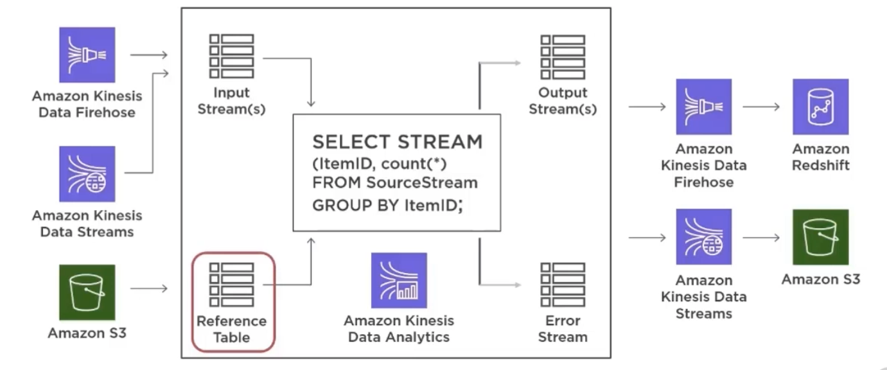

Video Streams

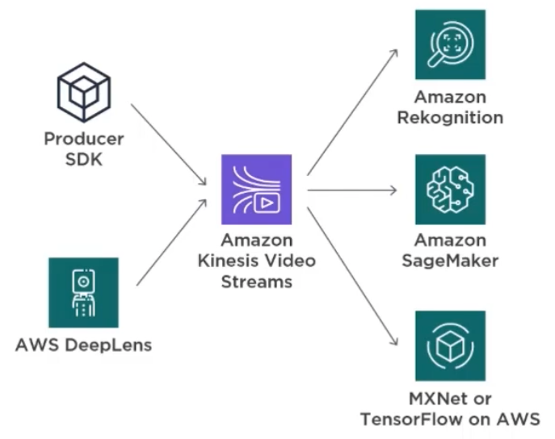

## Batch Ingest on AWS for Machine Learning

Batch Processing

* Data scope is limited to query processing over all or most of the data
* Queries done on large batches of data
* Performance has latencies in minutes to hours
* Analyses are complex
* RUns asynchronously and automatically across multiple compute instances

Data Migration Service

* Migrate external databases to AWS
* Source database remains available
* Allows homogeneous migration, as well as heterogeneous
* Continuous data replication
* Change data capture

AWS Batch

* Docker containers
* Dynamically provisioned compute (ec2 and spot)
* Fully managed, serverless
* Cost-optimized resource provisioning
* Schedule with cloud watch
* Orchestrate workflows with step functions

AWS Glue

* Fully managed ETL service
* Glue job - business logic for ETL
* AWS glue data catalog - metadata
* Glue crawlers
* Automatic schema discovery
* Built in transformations
* Glue jobs can be time based or event based

Glue vs DMS

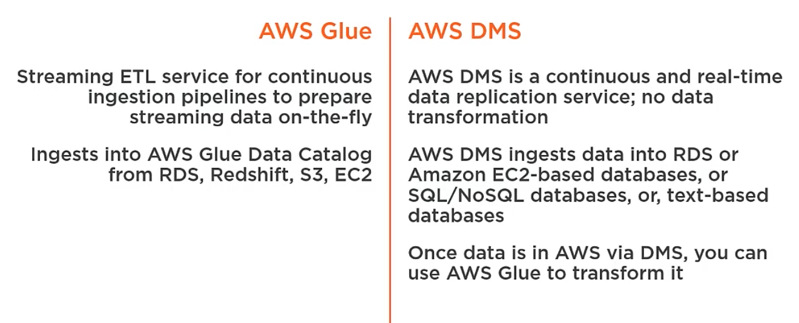

Glue vs Batch

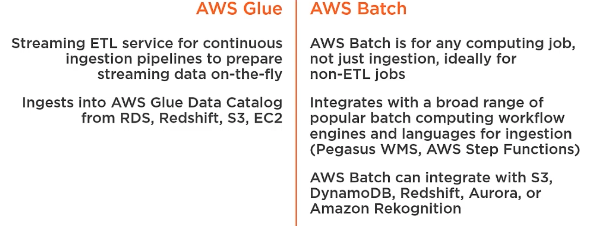

Exam Tips

* High level knowledge of what is batch processing
* What DMS is used for, 1 step vs 2 step (hetero is 2 step with a schema convesrsion in the mix)

## Data Transformation For ML

Ingest raw data, then prepare for consumption

Preparing data for downstream consumption:

* Data normalization
    * ORC and Apache Parquet
* Data partitioning
    * Less data scanned, faster queries
* Data compression
    * Reduces storage and costs
* Storage Optimization
    * Reduces costs

Raw Data

* Store in Apache Hive Style Partition

Target Data

* Pick an open source columnlar store

Data Partitioning

* Date partitioning is popular, but look at how the queries are structured

Data compression

* Reduces storage, disk I/O - optimizes performance and cost

Storage Optimization

* Leverage s3 storage classes

ETL vs ELT

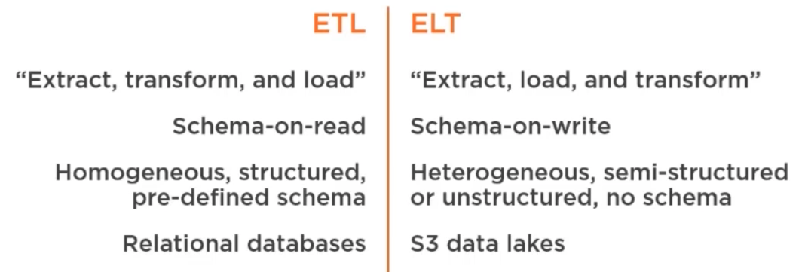

Exam Tips

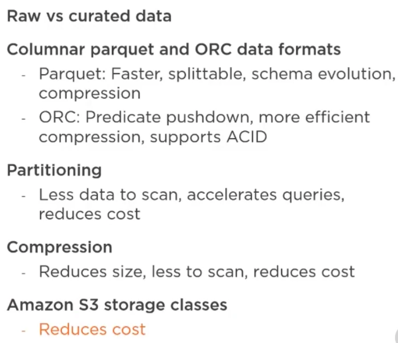

## Data-Driver Workflow

The AWS Data Pipeline

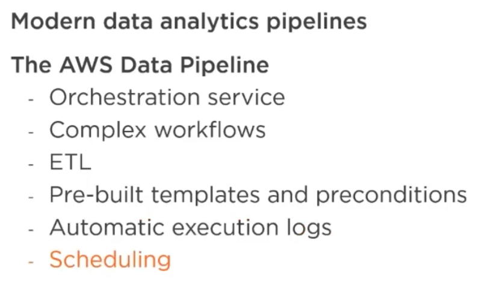

Glue vs Pipeline

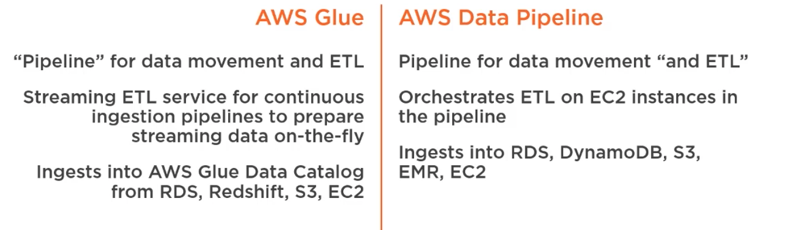

Using Pipeline in ML Scenarios

* Run pipeline on demand or schedule: take EC2 log files and move to s3, move s3 logs to EMR for analysis
* Data in RDS or DDB, want to move it to S3 
    * Use the pipeline to spin up ec2 instance, connects to db to move to s3, now available for sage maker

Exam Tips

* Know pipeline at a high level
* ETL via EC2

## Data Transformation Using Apache Spark

Amazon EMR

* Fully managed hadoop framework on ec2 instances for running massively parallel compute
* Decouples compute from storage, petebyte scale analysis of data from s3
* Orchestration via zepplin and EMR notebooks (managed analytics environment based on jupyter notebooks)
* Reliable, elastic, secure
* Multiple data storage options - s3, hdfs, ebs, dynamofb, redshift, rds, glacier
* ML, ETL, ClickStream, Genomics

Apache Spark

* Fast unified analytics engine, process TBs for data
* Massive parallelism (1000s of nodes)
* DataFrames, DAGs, RDD, Vector and LabeledPoint
* SparkML: linear algebra, statistics, run in parallel
* Regression, classification, clustering, pattern mining

Spark Framework - the can run in parallel on massive clusters

* Spark core - R, Python, Scala, Java API
* MLlib
* Streaming
* SQL
* GraphX

Spark and SageMaker Integration

* data ingestion and transformation via spark, model training, testing and validation, and deployment using sage maker
* data ingestion, data transformation, model training, testing and validation on spark, deployment using sage maker

Exam Tips

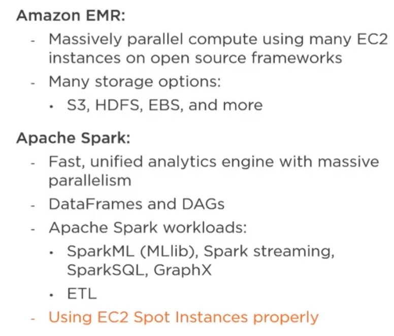
 
 Don't use spot instances for core or master nodes or you can lose data

 ## Data Transformation Using Glue, and Amazon Athen

 Glue

 * AWS Glue Data Catalog
 * Crawlers
 * Eliminates dark data
 * AWS Glue ETL Operations - generate code using metadata
    * Scala
    * PySpark
* Streaming ETL in AWS Glue - clean and transform streaming data
* AWS Glue Jobs System
* Monitor and receive alarms

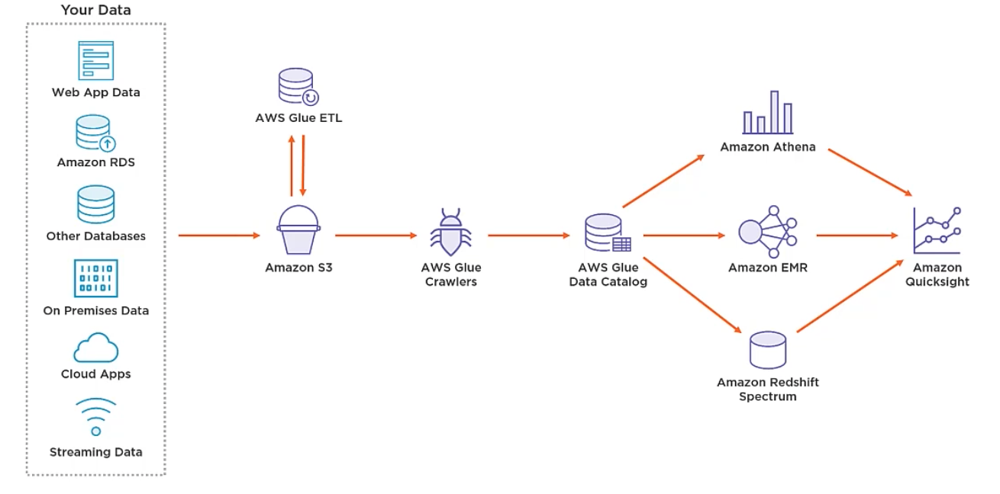

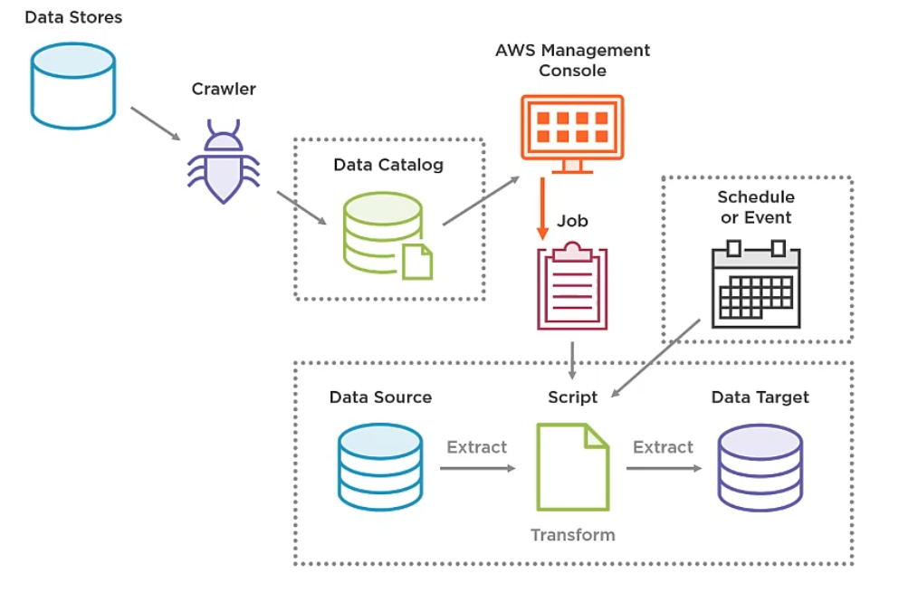

Glue and Lake Formation

* Glue is the foundation, lake extends the overall solution

Glue Catalog - Can be used by these services

* Athena
* Redshift Spectrum
* Amazon EMR
* AWS Glue Data Catalog for Apache Hive Metastore

Crawlers

* Inventory the data in data stores
* Use built in classifiers and customer classifiers
* Connect to the data store, crawl to infer the schema, write metadata to catalog

Glue Jobs

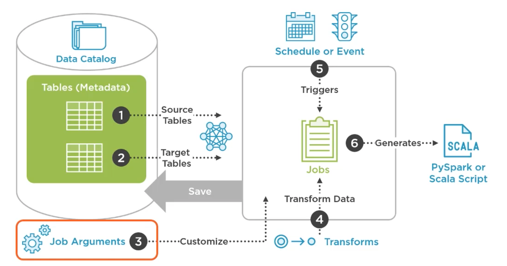

Built-in Data Transforms to Use in PySpark ETL Operations

* Data passes from transform to transform using DynamicFrames
* For the exampe know the following
    * DropFields
    * DropNullFields
    * Filter 
    * Join
    * Map
* Also
    * Relationalize - converts DynamicFrame to a relational form (rows and columns)

Glue ETL

* Supports transformation between different formats
* Supports CSV, JSON, Avro, Parquet, ORC, XML, Amazon Ion (input), grokLog (LogStash), glueparquet

Streaming ETL

* Supports CSV, JSON, PArquet, ORC

ML transforms also supported

Demo

* S3 data (raw zone) -> Lambda -> Crawler -> Populate data catalog
* After catalog update, create glue job
    * Job -> run ETL -> Populate target data

Amazon Athena

* Interactive query service based on Presto
    * Standard SQL
* Unstructured, semi-structured, and structured data
* Serverless, autoscales
* Queries in parallel
* Read and write encrypted data
* Integrated with glue catalog

Good for:

* Ah hoc queries
* Complex analyses: large joins, window, functions, arrays
* Supports partitioning, compression
* Federated query
* Native integration with Amazon QuickSight

Athena supported data formats - read:

* TSV, CSV, Custom
* JSON
* Parquet, ORC
* Logstash
* CloudTrail logs
* Apache web server logs

Writing data:

* Parquet, ORC, Avro, JSON, text

Glue and Athena Together - Typical Flow

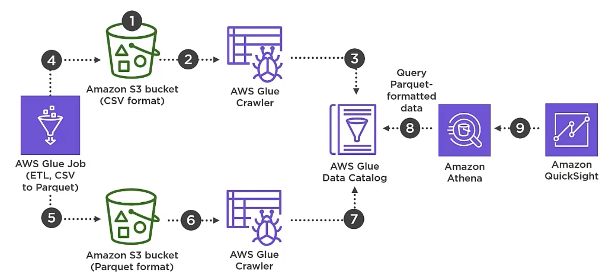

ML + Athena (Preview)

* Invoke ML algorithms across text analysis, statistical tools, and any algorithm deployed on SageMaker
* Invole ML models in SQL queries from Athena console, Athena APIs, and through Athena's JDBC and ODBC drivers in tools like Amazon QuickSight
* Logictic regression to find anonolies, what if analysis and Monte-Carlo simulations, forecasting to predict values, k-means clustering to differentiate customer segments, etc

Exam Tips

* AWS Glue Data CAtalog
    * Central metadata repository for all your data
    * Versioning
* AWS Glue Crawlers
    * Infers schema
    * Populate the AWS Data Catalog
    * Can run on demand or triggered by a time or by event
* AWS Glue Jobs
    * ETL transformation
* Amazon Athena
    * Serverless, interactive query service to query structured, semi-structured, and unstructured data without the need to first perform ETL, directly on S3 using SQL

    

