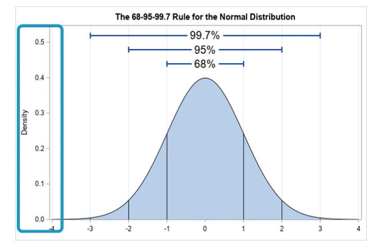
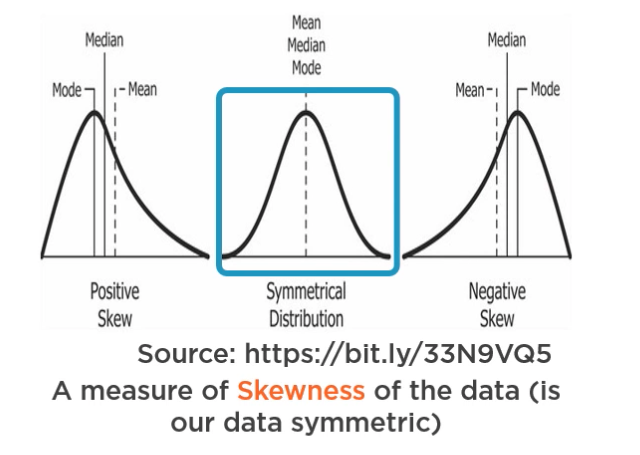
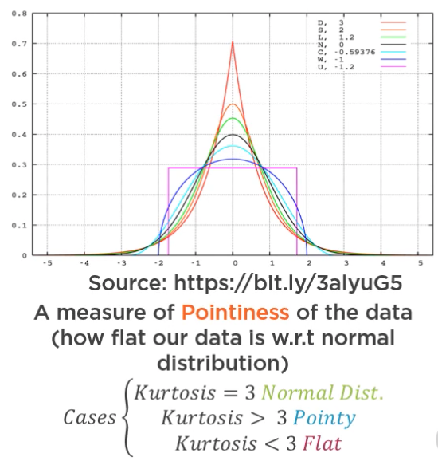
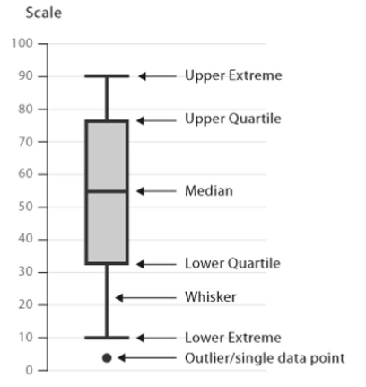
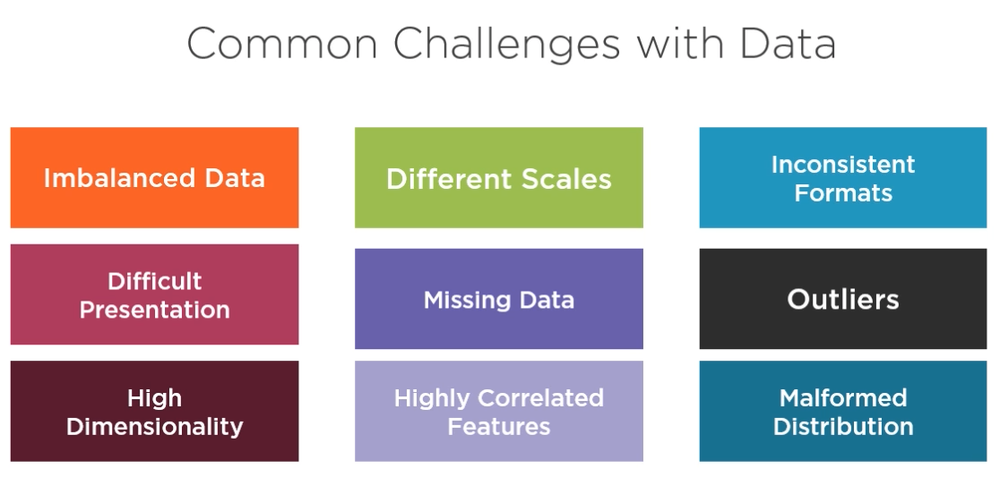
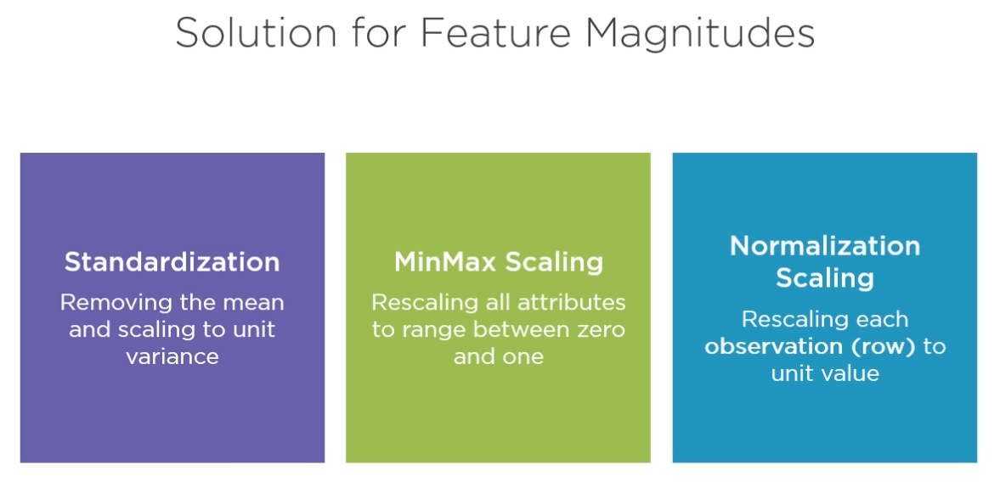

# Exploratory Data Analysis with AWS Machine Learning

## Course Overview

ML Pipeline

* Data sourcing - Glue, Kinesis - 20% of exam
* Data preparation 705-80% - 24% 
    * Analysis and visualization
        * Quicksight
    * Preprocessing and feature engineering
        * SageMaker Notebooks, Ground Truth
* Model Training - choose alg and train model
* Model Evaluation
* Model Deployment
* Model Monitoring

Operationalization - model deployment and monitoring

## Machine Learning with AWS

Data Analysis

* The process of inspecting, cleansing, transforming and modeling data with the goal of discovering useful information, informing conclusions and supporting decision making. 

ML COntext

* ML algorithms have specific expectations of data. Therefore we need to study our data and align it with ML model expectations

Dataset for Course

* Ames Housing Dataset
* Different categories of data - 82 cols
* Originally used to forecast housing prices

Environment Setup

* Create a notebook instance
    * Name - HousingPriceDataAnalysis
    * Stick with the defaults
* Once created, open Jupyter
* Use 'Upload' button the upload dataset to the notebook instance
* Then... New Conda Python 3 for a new notebook instance, change notebook name

Note

* Download dataset was an xls - can get the csv from https://www.kaggle.com/prevek18/ames-housing-dataset

## Data Analysis using AWS

Case Study: Globalmantics AI Team

* Fictional
* Housing sales data in many disparate systems
* Data engineering team pulls the data, make it available to other team
* Data analysis team work on the data, makes it available to the machine learning team
* ML team builds models, turns them over to the operalization team
* Ops team is responsible for the model in prod
* Simplified org model

Data Analysis Team Responsibilities

* Data analysis - statistical techniques
* Data visualization
* Feature engineering (scaling, imputing, etc.)

Data in the RealWorld

* Numerical
    * Discrete - counts, integers
    * Continuous
* Categorical Data
    * Nominal - no ordering implied
    * Ordinal - different values have a mathematical significance
* Unstructured Data
    * Text, audio, video, images
* Time Data

Naming Things Like a Pro

* Rows - observations, instances
* Columns - features, dimensions, or attributes
    * some we will remove, e.g. randomly generated IDs

### Statistics

* Univariate stats - stats over a single variable
    * Minimum, maximum, range (max - min), count, sum, mean (sum/count), median (middle value when ordered), mode (most common value), standard deviation, measure of spread, variance (square of std deviation)
    * Quartiles - based on data ordered in ascending, Q1 which value is higher than 25% of the data, Q2 is the value higher then 50% of the data (the median), Q3 is the value higher than 75% of the data.
    * IQR = Q3 - Q1, good for determining outliers

* Bivariate Statistics - stats over 2 variables
    * Correlation - tells us to what degree two variables are linearly related
        * Example - temperature and ice cream sales, temp and jacket sales
    * Pearson correlation - -1 to 1, -1 inverse relationship, 1 is high positive relationship

The Correlation Fallacy

* Dry hot weather - people eat ice cream, people get sunburns, ice cream and sunburn may be correlated, but obviously there is no causation

### Probability

Probability 

* The chance something will happen. Zero is impossible, One is certain.
* Probability = number of ways something can happen / number of all possible outcomes
    * Example: Roll one dice, prob of getting 4= 1/6 (1 4 face, 6 total faces), prob of event = 1/6

Random Variable

* Random variable X is a veriable describing the set of possible values of a random function

Probability Functions

* Probability Mass Function - probability of a discrete random variabe happening
    * Dice: P(X) = 1/6 when 1 is less than or equal to x which is less than or equal to 0, zero otherwise
* Probability Density Function = probability of a continuous random variable happening

### Data Distribution

ML algorithms assume certain distributions of your data

* Need to do specific steps to ensure the assumptions are met

Normal Distribution

* Centered around zero, 4 standard deviations on each size, density scale with area under curve summing to 1.
* Mean is 0. 68% of the points are within 1 standard deviation, etc.
* Considered good yo describe everyday life events (central limit theory)
* Main assumption for many ML algorithms
* Mathematical resilience

Metrics for Data Distribution

* Skewness
    * Measure of how symetrical the data is
    * Pearson's skewness - (mean - mode)/(standard deviation)
        * Symmetric - abs val skewness between 0 and less then 0.5
        * Moderate - abs valskewness greater than 0.5, less than one
        * High - abs val greater than one
    
* Kurtosis
    * A measurement of how pointy the distribution is
    

## Data Visualization

A picture is worth a thousand words

* Make it easier to comprehend data 
* Make it easier to understand how well our ML alg is performing
* Make it easier to discover relationships in data

Box and Whisker Plot

* Useful to summarize descriptive statistics
* Good for spotting outliers

Types

* Comparison
    * Bar Charts - different catagories on X, use bars to compare, help understand ranges
    * Line chart - compare progression over time, trend lines, helps to relate direction with time events
* Relationship
    * Scatterplot - see relationship between two variables, shows correlation
    * Heatmap - correlation matrics between two values, color denotes the strength of the relationship between two variables, helps identify useful features, more readable
* Composition
    * Pie chart - see the relative composition, percentage distribution
* Distribution
    * Histogram - distribution over a range of values

Bar Chart vs Histogram

* Bar chart shows values of different categories, histogram shows frequency of data.
* Bars do not have to be ordered in a bar chart, should be ordered in a histogram.

### QuickSight

Business oriented data visualization tools

* Low price
* Scalable
* SPICE engine

Demo

* Manage data - upload the csv

## Data Preparation Using AWS

Common Data Challenges

Sources of data errors:

* User and system errors, no data validation.
* Heterogenous data sources with different business rules
    * Different units
* Hards facts
    * Not enough data, data with too many dimensions

Problem: Imbalanced Data 

* Fraud detection - train on data with 98% legit transaction 2% fraudulant, model in prod misses fraud
* The training data is imbalanced - model could not learn enough about fraud

Solutions for Unbalanced Data

* Undersampling majority classes
* Over sampling minority classes
* Generating synthentic data based on the characteristics of the data

Problem: Scale of Features

* Some features might have multiple scales
    * Current in dollars vs pounds sterling
* Many ML algortithms are sensitive to magnitude
    * K-Means clustering uses Eudlidean Distance
    * cm vs inches

Solutions for Feature with Multiple Scales

* Scale to same units

Solutions for Feature Magnitudes

Problem: Inconsistent Formats

* Might be due to not following organized formats due to lack of upstream data validation
    * e.g. location column with values 'Madrid, Spain', 'Sweden', and 'California'

Solutions for Inconsistent Formats

* Prevent upfront via validation
* Fix manually
* Deduce patterns in the data
* Use fuzzy matching - E.G. Levenshtein distance
    * Python lib named Fuzzy Wuzzy

Problem: Different Presentation of Data

* Machine learning algorithms operate on numbers
    * What if we have video or audio data?
    * What if we have categorical data?

Categorical Data

* Label Encoding
    * Assigns a unique number for every category
        * e.g. Japan, China, USA becomes 1,2,3
        * Not recommended for dataset features with many categories
    * One-Hot Encoding
        * Convert each category to a column, assigns 1 to the category, zero to others

Problem: Missing Data

* Missing data can degrade model quality
* Common problem in ML
    * Optional fields
    * Newly introduced columns
    * Failure of input systems

Missing Data Solutions

* Drop observations with missing values
    * simple but can lose critical data
* Ignore missing values
    * Some algortims work with missing values
    * Implementation specific
* Impute Missing Values
    * Mean, Median, Mode, Predict missing values

Problem: Outliers

* Real world data is not ideal
    * Entry mistakes
    * Data processing errors
    * Extremely rate non-representative conditions (aka novelties)
* They mess-up statistical characteristics of the data
* Sometimes a necessary evil

Solution for Outliers

* Finding Outliers
    * Classify data points that has a Z-Score bigger than absolute of specific data
    * Classify data points outside the IQR
    * Box and scatterplots help detect outliers
* Handling
    * Removal
    * Correction

Problem: High Dimensionality

* WHen we have too many dimensions
* Why bad?
    * Hard to visualize
    * Increases risk of overfitting
    * Training becomes more difficult

Solution for High Dimensionality

* Feature engineering
    * Creating meaninful features from existing features, e.g. life span = death year - birth year
* Feature selection
    * Selecting subset of existing features
* Dimensionality reduction
    * Reducing dimensions of data to brand new dimensions

PCA: Principal Component Analysis

* Objective: reduce from n-dimension dataset to a k-dimension dataset, by finding k vectors onto which to project the data so to minimize the projection error.
* Can be difficult to explain new features to others

Problem: Highly Correlated Features

* aka multicollinearity
* Occurs when independent variables (predictors) are correlated
* Big problem for regression problems
    * Multicollinearity violates definition of regression
* Regression coefficient refers to the changes in a dependent variable when a dependent variable is changed while the others are held constant.

Solutions

* Feature removal based on correlation matrix
    * Simple, but the view will be limited to one feature, no holistic view
* Feature removal based on variance inflation factor (VIF)
    * VIF is a value that tells us how much collinearity each independent variable has wrt all other independent variables
    * VIF = 1 - not correlated, Between 1 and 5 - moderately correlated, Greater than 5 = highly correlated

Problem: Malformed Data Distribution

* Many machine learning algorithms assume the data set is Guassian (normally distributed)
* In practice, most datasets are not
* Normally evaluated visually or via normality technques

Solutions

* Thesholding with long tails
* Removing outliers and extreme values
* Applying power and log transformations

