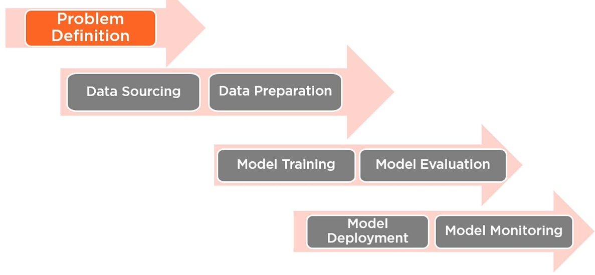

# Exploratory Data Analysis with AWS Machine Learning

## Course Overview

ML Pipeline

* Data sourcing - Glue, Kinesis - 20% of exam
* Data preparation 705-80% - 24% 
    * Analysis and visualization
        * Quicksight
    * Preprocessing and feature engineering
        * SageMaker Notebooks, Ground Truth
* Model Training - choose alg and train model
* Model Evaluation
* Model Deployment
* Model Monitoring

Operationalization - model deployment and monitoring

## Machine Learning with AWS

Data Analysis

* The process of inspecting, cleansing, transforming and modeling data with the goal of discovering useful information, informing conclusions and supporting decision making. 

ML COntext

* ML algorithms have specific expectations of data. Therefore we need to study our data and align it with ML model expectations

Dataset for Course

* Ames Housing Dataset
* Different categories of data - 82 cols
* Originally used to forecast housing prices

Environment Setup

* Create a notebook instance
    * Name - HousingPriceDataAnalysis
    * Stick with the defaults
* Once created, open Jupyter
* Use 'Upload' button the upload dataset to the notebook instance
* Then... New Conda Python 3 for a new notebook instance, change notebook name

