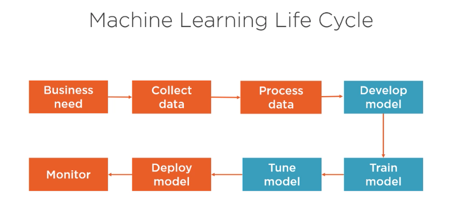
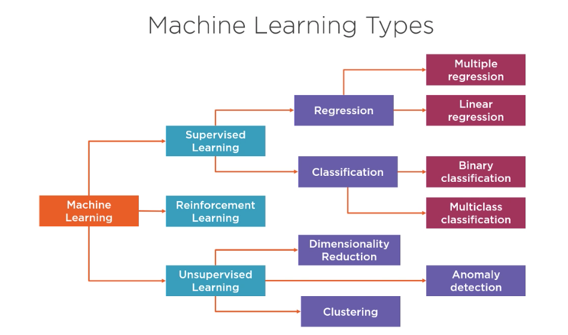

# Modeling with AWS Machine Learning

## ML Foundation and Built In Algorithms

ML Life-cycle

When not to use ML

* Lack of data
* Lack of computational power
* Need exact results
* Solved by appying simple rules

ML Types

* Business problems that are quatitative, continous in nature - regression (univariate and multivariate)
* Discrete output - classification (binary and multi class)

Common Params

* Channel name - named input source for training algorithm. In some cases can specify validation data channel too.
* Registry path - container registry path
* Input Mode
* File Type
* Instance class (cpu, gpu, both)
* Distributed

Support File Type

* Text - single sentence per line separated by space
* CSV - first column must be the label
* JSON 
* RecordIO - binary data
* Parquet - open source columnlar format

Support Readed Operations

* File mode - read all from s3 to training mode before your process
* Pipe mode - stream the data

Linear Learner

* Steps
    * Preprocess
        * Manually, or let algorithm normalize the data, shuffle
    * Training - SGD during training, can use ada, adagrad, etc optimizations
        * Parallely run differnent models concurrently
    * Validate
* Learning type: regression/classification
    * data - rows are observations, columns features plus a label
    * channels - train, validation, and test channels
    * file type - recordio, csv for training, json too for inferencec
    * instance type - cpu, gpu
    * metrics - loss function, accuracy, F1 score, precision, recall
        * tune against a validation metric, not a testing metric
    * required hyper parameters
        * feature_dim, num_classes, predictor_type

XGBoost

* learning type: regression/classification
* file type: libsvm, csv
* Instance type: cpu
* metrics - accuracy, AUC, F1 score, MEA, MAP, MSE, RMSE
* num_round, num_class

K-NN

* Sampling - size of initial data set is optimized to fit in memory
* Diminsionality reduction - remove noise, mimimize memory
* Index building - fast lookup of k nearest neighbors
* learning type: regression (mean of k nearest values), classification (majority label k-nn)
* file type: record io, csv
* instance type: cpu, gpu
* classification: accuracy, regression: mse
* hyperparameters: K, feature_diminsions, predictor_type, sample_size, diminsion_reduction_target

Random Cut Forest

* For anomoly detection
* Random sampling
* Slice into a number of equal partitions, create binary trees from partitions
* Choose hyper params including number of trees
* learning type: unsupervised
* file type: recordio, csv
* instance type: cpu
* metrics: F1 score
* Required hyperparameters: feature_dim, num_trees, num_samples_per_tree

