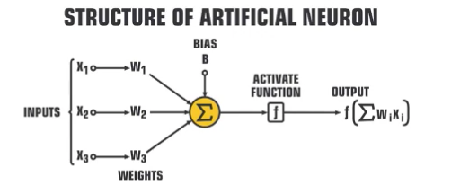
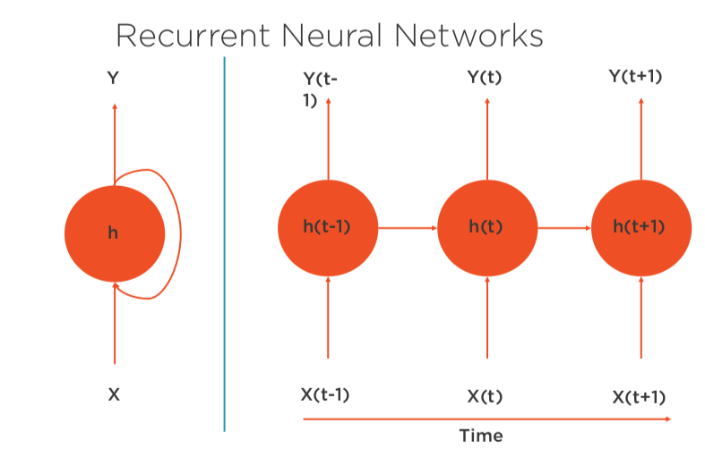
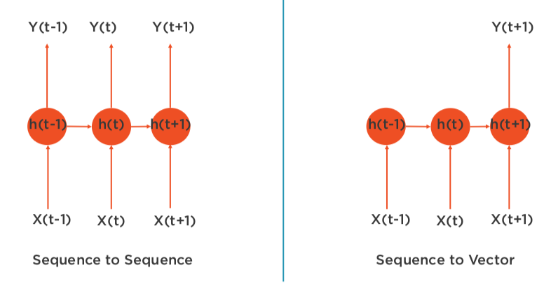
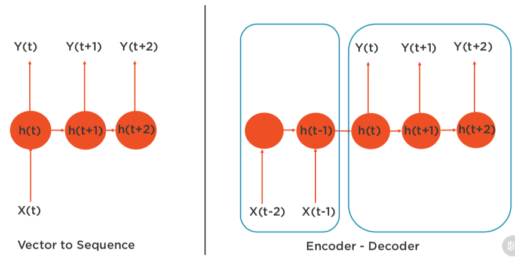
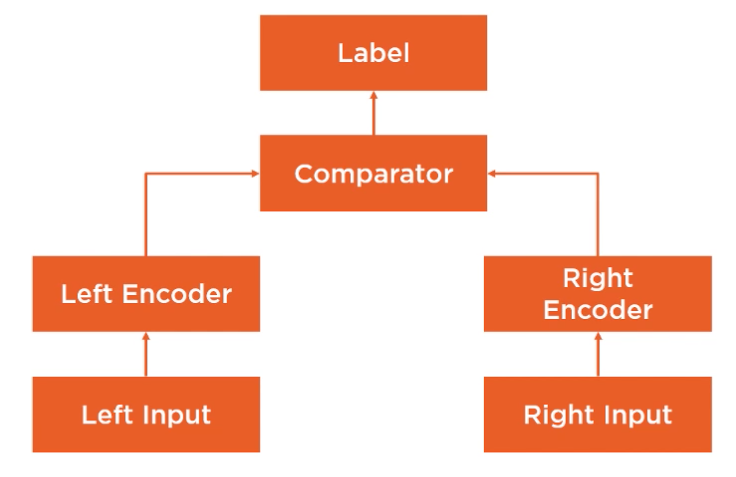

# Modeling with AWS Machine Learning

## ML Foundation and Built In Algorithms

ML Life-cycle

When not to use ML

* Lack of data
* Lack of computational power
* Need exact results
* Solved by appying simple rules

ML Types

* Business problems that are quatitative, continous in nature - regression (univariate and multivariate)
* Discrete output - classification (binary and multi class)

Common Params

* Channel name - named input source for training algorithm. In some cases can specify validation data channel too.
* Registry path - container registry path
* Input Mode
* File Type
* Instance class (cpu, gpu, both)
* Distributed

Support File Type

* Text - single sentence per line separated by space
* CSV - first column must be the label
* JSON 
* RecordIO - binary data
* Parquet - open source columnlar format

Support Readed Operations

* File mode - read all from s3 to training mode before your process
* Pipe mode - stream the data

Linear Learner

* Steps
    * Preprocess
        * Manually, or let algorithm normalize the data, shuffle
    * Training - SGD during training, can use ada, adagrad, etc optimizations
        * Parallely run differnent models concurrently
    * Validate
* Learning type: regression/classification
    * data - rows are observations, columns features plus a label
    * channels - train, validation, and test channels
    * file type - recordio, csv for training, json too for inferencec
    * instance type - cpu, gpu
    * metrics - loss function, accuracy, F1 score, precision, recall
        * tune against a validation metric, not a testing metric
    * required hyper parameters
        * feature_dim, num_classes, predictor_type

XGBoost

* learning type: regression/classification
* file type: libsvm, csv
* Instance type: cpu
* metrics - accuracy, AUC, F1 score, MEA, MAP, MSE, RMSE
* num_round, num_class

K-NN

* Sampling - size of initial data set is optimized to fit in memory
* Diminsionality reduction - remove noise, mimimize memory
* Index building - fast lookup of k nearest neighbors
* learning type: regression (mean of k nearest values), classification (majority label k-nn)
* file type: record io, csv
* instance type: cpu, gpu
* classification: accuracy, regression: mse
* hyperparameters: K, feature_diminsions, predictor_type, sample_size, diminsion_reduction_target

Random Cut Forest

* For anomoly detection
* Random sampling
* Slice into a number of equal partitions, create binary trees from partitions
* Choose hyper params including number of trees
* learning type: unsupervised
* file type: recordio, csv
* instance type: cpu
* metrics: F1 score
* Required hyperparameters: feature_dim, num_trees, num_samples_per_tree

## Deep Learning Foundation and Algorithms

Deep learning drivers

* lack of domain expertise
* complex business problems
* lots of computational power 
* lots of data

Activation

* Step
* Sign
* Sigmoid (for non-linearity)
* Rectifier linear unit (RELU, eliminate negative units, faster training, scales well)

Neural Network

* Input layers, one or more hidden layers, output layer
* Artificial Neural Network - pattern recognition, feedback network
* Convolution Neural Network - image processing, feed forward
* Recurrent Neural Network - speech
* Deep Neural Network - stochastic modeling
* Deep Belief Network - cancer detection

ANN

* Forward prop: inputs, weights, activations -> outputs
* Output compared to training, error fed back to adjust weights
* Iterative process

### Image Classification

* Supervised learning alg, uses CNN
* Use for binary and multiclass classification
* file type: recordio, image
* instance type: gpu for training, cpu for interence
* modes: full mode, transfer mode
* metric: accuracy
* hyperparameters: num_classes, num_training_samples

### Object Detection

* learning type: supervised, single deep neural network (DNN)
    * takes image, outputs the objectd and a classification
* file type: recordio, augmented manifest image
* instance type: gpufor training, cpu or gpu for inference
* Trainig modes: full or transfer
* Metrics: mean average precision
* hyperparameters: num_classes, num_training_samples

### Semantic Segmentation

* Use cases include computer vision applications like self driving cars and medical imaging diagnostics
* Progression from coarse grained to fine grained, goes deeper
* Fine grained pixel level approach, tags each pixel with a predefined classs
* Identifies objects and shapes of objects
* Supervised/classification
* file type: recordio, augmented manidest image
* gpu for training, gpu or cpu for inference
* metric: intersection over union aka jaccard index
* hyper parameters: num_classes, num_training_samples

### Recurrent Neural Networks (RNNs)

Use cases:

* sequence prediction
* autocompletion
* market predictions

Needs historical context to predict

* Changes feed forward architecture to use a hidden state to remember calculations up to that point in time

RNN Configurations

seq to seq - use in stock predictions
seq to vec - used in reviewing systems - thumbs up/down
vec to seq - one input, seq of outpus, image captioning
encoder - decoder: used for language translation.

### Blazing Text

Word2Vec - can use for sentiment analysis

Text classification - for tasks like web searches

Blazing Text

* Word to vec, text classification
* Text classification (supervised)
    * Works only on words and sentences
    * input one sentance per line, first word \_\_label\_\_
* Word2Vec  (unsupervised)
    * Plain text file, one sentence per line
    * 3 modes: cbow, skipgram, batch skip gram
    * mean_rho (word2vec), accuracy (text classification)
* hyperparameter: mode

### Seq to Seq

* RNN - 3 main layers
    * Embedding layer - matrix of input tokens mapped to a dense feature layer
    * Encoder layer - compresses info, produces features vector of fixed length
    * Decoder - takes input vector that was encoded and decodes them to produce sequence of output tokens
* Supervised, sequence of tokens to seq of tokens, machine translation, speech to text
    * Uses RNN and CNN in encoder/decoder architectures
* File type: recordio, json
* Trained on gpu only
* Metrics: accuracy, bleu, perplexity
* No required hyperparameters

### Object2Vec

* 3 steps
    * Process data - shuffle data, convert to json lines format
    * Train the alg - see figure
        * Encoders options: bidirection lstm, CNNs, average pooled embeddings
    * Produce inference
        * Singleton inputs to fixed length embeddings, or predict relationship label between pair of inputs

* Unsupervised, can operate at different levels, often used to reduce dimensionality
    * Used in genre prediction, recommendation systems
* File type: data pairs, discrete tokens, or seq of discrete tokens
* Cpu or GPU training, gpu inference
* Metrics: RMSE (regression), accuracy and cross entropy(classification)
* Hyperparameters: enc0_max_seq_len, enc0_vocab_size

## Train ML Models

SageMaker Features

* Integrated with AWS SSO
* No explicit set up
* Flexible - scale up/down
* Automated software updates
* Integration with external repositories

Lab - predict if a customer will open an email using XGBoost

* Instance types ml.<instance family><version no><size>