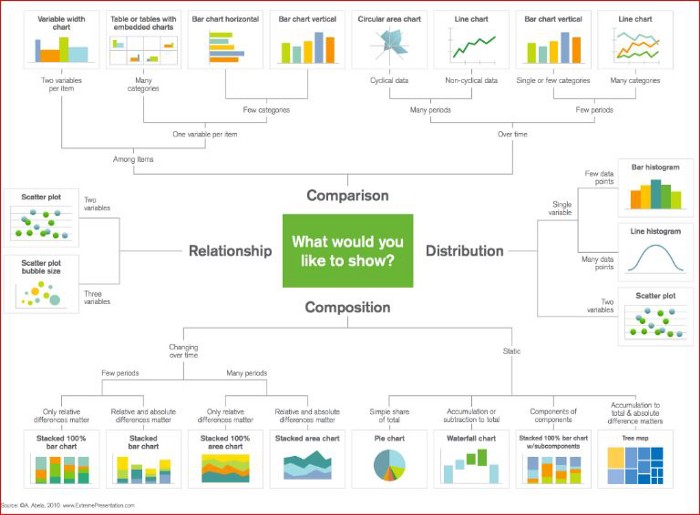
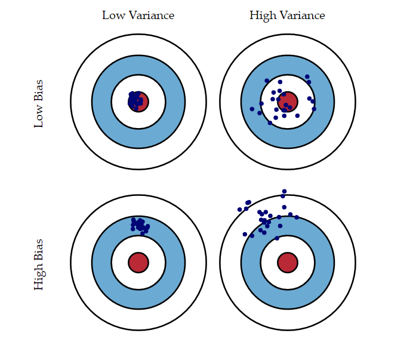

# Some Additional Refs

## References

* Pipe Mode - CSV Data Set - see [here](https://aws.amazon.com/blogs/machine-learning/now-use-pipe-mode-with-csv-datasets-for-faster-training-on-amazon-sagemaker-built-in-algorithms/)
* TF-IDF - see [here](https://scikit-learn.org/stable/modules/generated/sklearn.feature_extraction.text.TfidfVectorizer.html)
* [Article on batches and training](https://arxiv.org/pdf/1609.04836.pdf)
* Binary Model Insights - see [here](https://docs.aws.amazon.com/machine-learning/latest/dg/binary-model-insights.html)
* Adjusting class probability to increase sensitivity at the trade off of precision - see the Discussion section of [this](https://academic.oup.com/bib/article/14/1/13/304457) paper.
* SMOTE - [this](https://www.jair.org/index.php/jair/article/view/10302)
* Imputing missing data - [this](https://www.hilarispublisher.com/open-access/a-comparison-of-six-methods-for-missing-data-imputation-2155-6180-1000224.pdf)
* Handling missing values for classification - page 1627 [here](https://jmlr.csail.mit.edu/papers/volume8/saar-tsechansky07a/saar-tsechansky07a.pdf), and see [this](https://www.annualreviews.org/doi/10.1146/annurev.publhealth.25.102802.124410) and [this](https://docs.aws.amazon.com/machine-learning/latest/dg/feature-processing.html).
* SageMaker [object2vec](https://aws.amazon.com/blogs/machine-learning/introduction-to-amazon-sagemaker-object2vec/)

## Reference Notes

### TF-IDF

See the tf-idf.ipynb notebook in this directory for details on how to count unigrams, bigrams, etc.

### Batches and Training

Gradient Descent

* Gradient - slope or slant of a surface
* Gradient descent - descending a slope to find its lowest point
    * GD is an iterative algorithm that starts on a random point on a function and travels down its slope in steps until it finds the lowest point of that function.
* In GD, learning rate is the step size for adjusting parameters values as we move down the gradient.
    * Learning rate heavily influences the convergence of the algorithm. Too big can jump across a minimum.
* Can be computationally expensive 
    * Sum of squared residuals consists of as many terms as there are data points
    * Need to compute the derivative for each of the features which the number of data points times the number of features

Stochastic Gradient Descent

* Stochastic - means random. 
* Reduces computation by selecting one point at random in each step to use to compute the derivatices.
* See [here](https://towardsdatascience.com/stochastic-gradient-descent-clearly-explained-53d239905d31)

Mini-Batch

* Seeks to balance precision of GD vs speed of SGD by sampling a small number of data points at each step.
* Large batch methods can fail to generalize as well as small batch. 
    * Large batch methods tend to converge to sharp mimimizers of the training function.
    * Small batch methods tend to converge to flat minimizers.

### Binary Model Insights

* Output of many binary classification algorithms is a prediction score. The score indicates the certainty that an observation belongs to the positive class.
    * Output is a score that goes from 0 to 1.
    * Consumer of the score must decide the threshold that indicates the cut-off between 0 and 1. The default cut off is 0.5.
* Accuracy metric for binary classification: Area Under the (Receiver Operating Characteristic) Curve (AUC)

### Adjusting Class Probability to Increase Sensitivity

> The decision threshold adjustment was developed to estimate the optimal decision threshold for specified misclassification costs and/or prior probabilities of the prevalence [10, 11, 13]. When the class sizes are unequal, a shift in a decision threshold to favor the minority class can increase minority class prediction.
> ...
> In summary, the effect of class imbalance depends on the imbalance ratio, total sample size in the training phase, distributions of the data in each class and selection of the relevant variables as well as the classification algorithm and correction strategy.


### SMOTE - Synthetic Minority Over-sampling Techique

* Imbalanced datasets - a dataset is imbalanced if the classication categories are not approximately equally represented.
* Typically...
    * Real world data set includes only a small percentage of abnormal/interesting examples
    * Cost of misclassifying an abnormal/interesting example much higher than the reverse
* Combination of over-samplingthe minority (abnormal ) class and under-sampling the majority (normal ) class can achieve better classifier performance (in ROC space )than only under-sampling the majority class

Referenced on the sample quiz...

* Bootstrapping is any test or metric that uses random sampling with replacement, and falls under the broader class of resampling methods.

### Instance Segmentation

> Many of the companies rely on image segmentation techniques powered by Convolutional Neural Networks (CNNs), which form the basis of deep learning for computer vision. Image segmentation involves drawing the boundaries of the objects within an input image at the pixel level. This can help achieve object detection tasks in real-world scenarios and differentiate between multiple similar objects in the same image.

> Semantic segmentation can detect objects within the input image, isolate them from the background and group them based on their class. Instance segmentation takes this process a step further and can detect each individual object within a cluster of similar objects, drawing the boundaries for each of them.

### SageMaker API

Training using SageMaker

* Create a training job. Training jobs include:
    * URL of the s3 bucket where the training data is stored
    * The compute resources you want Sagemaker to usefor model training
    * The url of the s3 bucket where you want to store the output of the job
    * The elastic container registry path where the training code is stored.
* Training options
    * Algorithm supplied by SageMaker
    * SageMaker debugger
    * Apache spark with sage maker
    * Custom python code that uses TensorFLow, PyTorch, or MXNet
    * Custom algoritms via containers
    * Algorithm via the AWS marketplace
* API
    * CreateTrainingJob

Model Deployment

* CreateModel API
* CreateEndpointConfig API
    * Specify a ProductionVariant for each model you want to deply
        * Use VariantWeight to specify how much traffic to allocate to each model
    * Use 2 or more initial instances to ensure HA - SageMaker will deploy to different AZs
* CreateEndpoint

Auto Scaling

* Use the application auto scaling API RegisterScalableTarget
    * ServiceNamespace is sagemaker
    * ResourceID is the resource identifier for the production variant. Resource type is endpoint, unique identifier is the name of the variant, e.g. endpoint/MyEndpoint/variant/MyVariant
    * ScalableDimiesion - sagemaker:variant:DesiredInstanceCount

Hyperparameter Tuning

* CreateHyperParameterTuningJob
    * Specify ranges of the hyperparameters you want to tune
    * Provide the objective metric for the tuning job

### Apache Spark with SageMaker

Docs [here](https://docs.aws.amazon.com/sagemaker/latest/dg/apache-spark.html)

* In this scenario, Apache Spark is used for preprocessing data and Amazon SageMaker is used for model training and hosting.
* SageMaker provides an Apache Spark library (in Python and Scala) that you can use to train models in SageMaker using Spark DataFrame data frames
* After Model training host the model using SageMaker hosting services.

### Kinesis Streaming Analytics ML Integration

Can use machine learning queries to perform complex analysis on data, relying on the history of data in the stream to find unusual patterns.

* RANDOM_CUT_FOREST function can assign anomaly scores to each record based on the values in numeric columns. 
* RANDOM_CUT_FOREST_WITH_EXPLANATION assigns an anomaly score to each record based on values in the numeric columns. The function also provides an explanation of the anomaly. 
* Amazon Kinesis Data Analytics provides the HOTSPOTS function, which can locate and return information about relatively dense regions in your data.

### AWS Batch - Overview

From the [docs](https://docs.aws.amazon.com/batch/latest/userguide/what-is-batch.html)

> AWS Batch enables you to run batch computing workloads on the AWS Cloud. Batch computing is a common way for developers, scientists, and engineers to access large amounts of compute resources, and AWS Batch removes the undifferentiated heavy lifting of configuring and managing the required infrastructure, similar to traditional batch computing software. This service can efficiently provision resources in response to jobs submitted in order to eliminate capacity constraints, reduce compute costs, and deliver results quickly.
>
> As a fully managed service, AWS Batch enables you to run batch computing workloads of any scale. AWS Batch automatically provisions compute resources and optimizes the workload distribution based on the quantity and scale of the workloads. With AWS Batch, there is no need to install or manage batch computing software, which allows you to focus on analyzing results and solving problems.

Components of Batch

> AWS Batch is a regional service that simplifies running batch jobs across multiple Availability Zones within a region. You can create AWS Batch compute environments within a new or existing VPC. After a compute environment is up and associated with a job queue, you can define job definitions that specify which Docker container images to run your jobs. Container images are stored in and pulled from container registries, which may exist within or outside of your AWS infrastructure.

* Jobs - units of work
* Job Definitions - defies how jobs are to be run
* Job Queues - Jobs are submitted to queues
* Compute Environment - set of managed or unmanaged resource that are used to run jobs.


### T-SNE

* t-Distributed Stochastic Neighbor Embedding
* Unsupervised, non-linear technique primarily used for data exploration and visualizing high-dimensional data
* PCA is a linear dimension reduction technique that seeks to maximize variance and preserves large pairwise distances
* t-SNE differs from PCA by preserving only small pairwise distances or local similarities whereas PCA is concerned with preserving large pairwise distances to maximize variance.

### SGD Optimization Techniques

Summary of excellent write up available [here](https://ruder.io/optimizing-gradient-descent/)

Gradient descent

* Technique to minimize an objective function by updating the parameters in the opposite direction of the gradient of the objective function.
* The learning rate determines the size of the steps we take to reach a (local) minimum

Variants (also see earlier in these notes)

* Batch, aka vanilla gradient descent
    * Computes the gradient of the cost function wrt the parameters of the entire training set

```
for i in range(nb_epochs):
  params_grad = evaluate_gradient(loss_function, data, params)
  params = params - learning_rate * params_grad
```

* Stochastic
    * Peforms an update for each training example

```
for i in range(nb_epochs):
  np.random.shuffle(data)
  for example in data:
    params_grad = evaluate_gradient(loss_function, example, params)
    params = params - learning_rate * params_grad
```

* Mini batch
    * Performs an update for each mini batch of n training examples

```
for i in range(nb_epochs):
  np.random.shuffle(data)
  for batch in get_batches(data, batch_size=50):
    params_grad = evaluate_gradient(loss_function, batch, params)
    params = params - learning_rate * params_grad
```

Challenges

* Choosing the learning rate. 
    * Too small - slow convergence
    * Too large - hinders convergence, may fluctuate around the minimum or event diverge
* Learning rate schedules try to adjust the learning rate during training by annealing, adjust the learning rate according to a predefined schedule or when the change in objective between epochs falls below a threshold
* Same learning rate for all parameter updates - might want larger updates for rarely occurring features
* Can get trapped in local minima/saddle points

Optimization Algorithms

* Momentum - handle oscillations across the slopes of a ravine to avoid locap optima by adding a fraction of the update vector of the past time step to the current update vector.
* Nesterov accelerated gradient - smarter version of momentum where you have some way of knowing where you are going so you can slow down before the hill slopes up again.
* Adagrad - good for sparse data. Adapts the learning rate of individual features, using lower rates (smaller updates) for parameters associated with frequent features, and larger updates for infrequent features.
* Adadelta - extension of adagrad that reduces the aggresively monotonically decreasing learning rate by restricting past squared gradients to a window. WIth adadelta there is no need to set a learning rate.
* Adam - adaptive moment escalation -  computes adaptive leanning rates for each parameter, acts like momentum with a heavy ball with friction running down a slope
* AdaMax - tweaks update rule scale of Adam
* RMSProp
* Nadam
* AMSGrad

Also...

* Early stopping - monitor error on a validation set during training and stop (with some patience) if not enough imprevement is observed.


### Factors the lead to the wide adoption of neural networks

* Data availability
* Computational scale, especially cheap GPUs
* Availability of algorithms and NN architectures that take advantage of large amounts of data. Better performance with very large neural networks and hige amounts of data

### Correlation strength

* positive is stronger, direction important not just magnitude

### SageMaker SDK

### Heat Maps

https://docs.aws.amazon.com/quicksight/latest/user/heat-map.html

https://towardsdatascience.com/better-heatmaps-and-correlation-matrix-plots-in-python-41445d0f2bec

### Data Visualization

https://towardsdatascience.com/5-quick-and-easy-data-visualizations-in-python-with-code-a2284bae952f



* Scatter Plots - show relationships between two variables
* Bubble Chart - scatter plot with point size/color used to encode a third variable
* Line plots - good to to if one variable varies greatly with another (high covariance)
* Histograms - useful for viewing the distribution of data points
* Barplots - good for visualizing categorical data (with catagories less than 10)
* Boxplots - more info than histograms: outliers, range of data (whiskers), first and third quartiles (bottom and top of box), median (2nd quartile, band in the box)


### Text Preprocessing

https://towardsdatascience.com/all-you-need-to-know-about-text-preprocessing-for-nlp-and-machine-learning-bc1c5765ff67

### Power Machine Learning at Scale

https://d1.awsstatic.com/whitepapers/aws-power-ml-at-scale.pdf

### Glue Crawlers

https://docs.aws.amazon.com/glue/latest/dg/add-crawler.html

### Validate a Machine Learning Model

https://docs.aws.amazon.com/sagemaker/latest/dg/how-it-works-model-validation.html

### Preprocess with SagMager inference pipelines and scikit-learn

https://aws.amazon.com/blogs/machine-learning/preprocess-input-data-before-making-predictions-using-amazon-sagemaker-inference-pipelines-and-scikit-learn/

### More on Sampling

https://en.wikipedia.org/wiki/Oversampling_and_undersampling_in_data_analysis
https://medium.com/@hazy_ai/imbalanced-data-and-credit-card-fraud-ad1c1ed011ea

### Sentiment Analysis using Comprehend, Glue, and Athena

https://aws.amazon.com/blogs/machine-learning/how-to-scale-sentiment-analysis-using-amazon-comprehend-aws-glue-and-amazon-athena/

### Tuning XGBoost Jobs

https://docs.aws.amazon.com/sagemaker/latest/dg/xgboost-tuning.html

### Regularization

https://towardsdatascience.com/regularization-in-machine-learning-76441ddcf99a

Ways to avoid overfitting:

* Understand the balance between bias and variance
* Use cross validation, which helps with estimating the error over the test set, and in deciding what parameters work best for your model

Regularization

* A form of regression that constrains/regularilizes or shrinks the coefficient estimates towards zero.
* Discourages learning a more complex or flexible model, so as to avoid the risk of overfitting.
* Types
    * Ridge - L2 type regularization, includes a lambda tuning parameter whose value determines how much to penalize the flexibility of the model
    * Lasso - aka L1 norm, penalizes only the high coefficients

Bias

* refers to the error that is introduced by approximating a real life complicated problem with a much simpler model

Variance

* Refers by which your estimate of f(X) would change if we estimated it using a different training data set



Cross validation

* An evaluation technique to estimate how well our learner will perform on an unknown data set
    * Hold out - hold back some data for model eval in the training phase
    * K fold cross validation - holding out data can result in underfitting. Therefore perform holdout validation k times with 1/k of the training data.
    * Stratified k-fold cross validation - tweak to k-fold validation to ensure each fold has the same number of samples of each target class

### Misc Tidbits

* KMS integration with SageMaker training and hosting: can specify a KMS key id to use when creating notebook instances, training jobs, or endpoints.
* Can query data in S3 using Presto - good for cheap BI and reporting against S3
* DataSets too large to fit into memory
    * In general, a best practice is to pack the data in parallel, distributed across multiple machines.
    * You should do this in a single run, and split the data into a small number of files with a uniform number of partitions.
    * When the data is partitioned, it is readily accessible and easily fed in as batches across multiple machines. When the data is split into a small number of files, the preparation job can be parallelized and thus run faster.
* Kinesis Data Analytics for SQL Apps can write outputs to Kinesis and/or Kinesis Firehose delivery stream